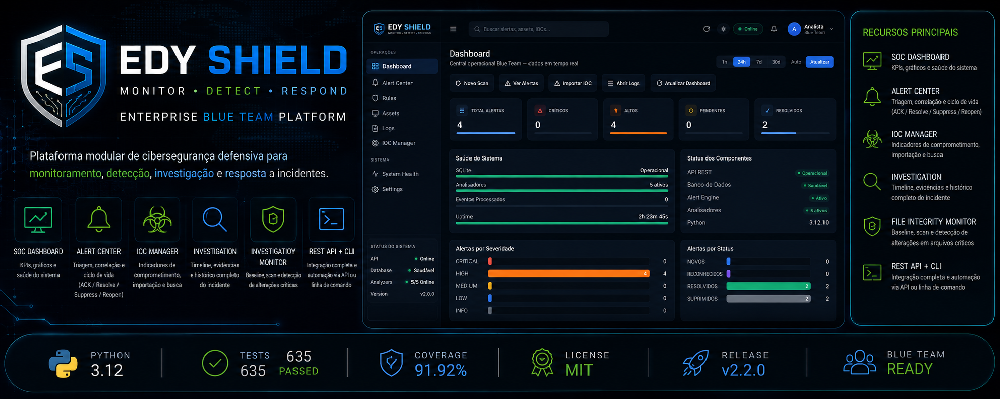
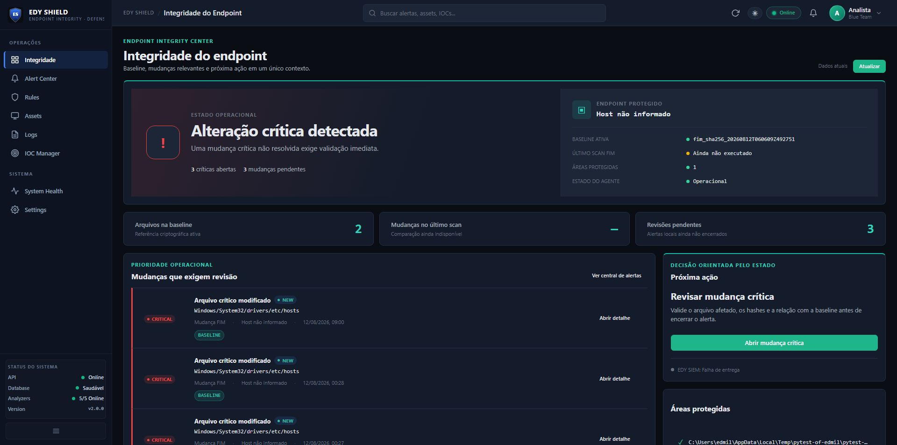
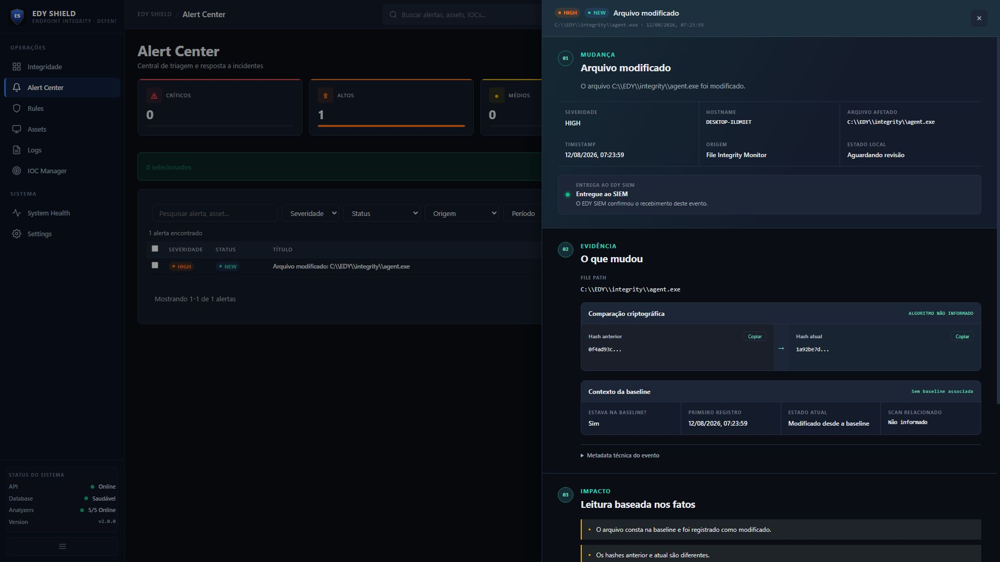
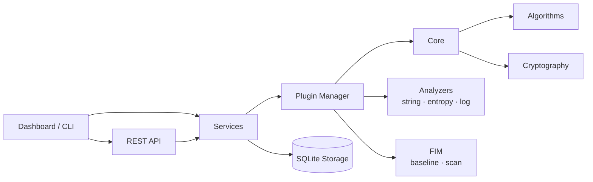

<div align="center">

# EDY Shield — Endpoint Integrity & Defense

Modern defensive security toolkit for file integrity, hash analysis and incident investigation.



[](https://www.python.org/downloads/)
[](LICENSE)
[](https://github.com/EDY075/edy-shield/releases)
[]()
[]()
[]()

</div>

---

## Overview

EDY Shield is an **Endpoint Integrity & Defense** platform written in **Python 3.12** with a **100% standard-library core** (zero runtime dependencies). It is local-first: FIM, baselines, scans, hash analysis and the local alert workflow remain available even when the SIEM receiver is unavailable.

It solves a practical problem: small security teams and blue-team operators need a lightweight, self-contained toolkit — no cloud, no agents, no license fees — to monitor critical files, triage alerts and investigate indicators of compromise on their own infrastructure.

**Capabilities**

- File Integrity Monitoring with baseline and comparative scan
- Hash verification (MD5, SHA-1, SHA-256, SHA-512)
- Log analysis and entropy/string analysis plugins
- Configurable alert engine with deduplication
- Endpoint Integrity Center with evidence, hash comparison and factual timeline
- Durable SQLite outbox for optional EDY SIEM Event Contract v1 delivery
- Safe EDY SIEM investigation handoff only after confirmed delivery
- REST API for automation and integration

---

## Features

**Endpoint Integrity Center** — Operational posture, baseline state, scan context and changes requiring review.

**Alert Center** — Triage table with filters, sorting, pagination and batch actions (ACK, resolve, suppress, reopen).

**Change investigation** — Factual change → evidence → impact → decision flow with hash comparison, baseline context and delivery state.

**Rules** — View active alert engine rules with severity and thresholds.

**Assets** — Inventory view of monitored assets.

**IOC Manager** — Interface for indicator-of-compromise workflows.

**Logs** — System log viewer with level filtering.

**System Health** — API, database, analyzer and uptime KPIs with plugin list.

**Export** — Alert investigation export to Markdown and JSON.

**REST API** — JSON API for alerts, health, history, analysis and FIM baselines.

**Dark / Light** — Full theme support persisted in browser.

**Responsive** — Optimized layout for desktop, tablet and mobile.

---

## Release screenshots

| Endpoint Integrity Center | Delivered change with SIEM handoff |
|---|---|
|  |  |

---

## Architecture

The application is layered with a strict one-way dependency rule: **UI → Services → Core**. The core never imports from UI or services.



**Frontend** — Vanilla HTML/CSS/JS single-page application (no frameworks). Served directly by the built-in HTTP server.

**Backend** — `http.server`-based REST API (Python standard library). Routes for alerts, health, history, analysis, FIM and plugins.

**Services** — Business orchestration: alert service, alert store, history, report engine, analysis.

**Storage** — SQLite via the standard library. Default database path overridable through `EDYSHIELD_DB_PATH`.

**Plugins** — Contract-based plugin system: `log_analyzer`, `hash_checker`, `file_integrity`, `string_analyzer`, `entropy_analyzer`.

**API** — JSON endpoints under `/api/*` (see `docs/API_STABILITY.md`).

---

## Project Structure

```
edy-shield/
├── app/
│   ├── cli/          # Command-line interface (edyshield)
│   ├── core/         # Algorithms, crypto, filesystem, validators, config
│   ├── plugins/      # Plugin contracts, registry and manager
│   ├── services/     # Alerts, analysis, history, reports, storage
│   └── ui/           # HTTP server + static dashboard
├── docs/             # Architecture, ADRs, threat model, screenshots
├── tests/            # Unit, integration and e2e tests
├── website/          # Marketing landing page
├── brand/            # Logos and visual assets
├── pyproject.toml    # Project metadata and tooling config
└── CHANGELOG.md
```

---

## Installation

### Requirements

- Python 3.12+

### Windows

```powershell
git clone https://github.com/EDY075/edy-shield.git
cd edy-shield
python -m venv .venv
.venv\Scripts\activate
pip install -e .
```

### Linux

```bash
git clone https://github.com/EDY075/edy-shield.git
cd edy-shield
python3 -m venv .venv
source .venv/bin/activate
pip install -e .
```

### macOS

```bash
git clone https://github.com/EDY075/edy-shield.git
cd edy-shield
python3 -m venv .venv
source .venv/bin/activate
pip install -e .
```

---

## Running

Start the web dashboard:

```bash
python -m app.ui.server
```

Then open <http://127.0.0.1:8000/dashboard>.

The REST API is available on the same host: <http://127.0.0.1:8000/api/health>.

CLI usage:

```bash
edyshield hash --help
edyshield fim baseline --help
edyshield fim scan --help
```

---

## Configuration

Configuration is environment-driven (prefix `EDY_`):

| Variable | Description | Default |
|---|---|---|
| `EDYSHIELD_DB_PATH` | SQLite database file path | `~/.edyshield/edy_shield.db` |
| `EDYSHIELD_LOG_LEVEL` | Logging verbosity | `INFO` |
| `EDY_SIEM_ENABLED` | Enables the optional Shield → SIEM delivery worker | disabled |
| `EDY_SIEM_URL` | SIEM receiver URL; HTTP is accepted only on loopback | — |
| `EDY_SIEM_TOKEN` | M2M ingestion token supplied only at runtime | — |
| `EDY_SIEM_UI_URL` | Safe SIEM UI base URL used for investigation handoff | — |

**SQLite** — All persistence (alerts, history, analysis, FIM baselines) lives in a single SQLite database.

**Plugins** — Enabled through the plugin registry; each analyzer implements the plugin contract (`app/plugins/contracts.py`).

**Directories** — Static assets, brand assets and documentation are organized under `app/ui/static/`, `brand/` and `docs/`.

---

## Testing

```bash
pip install -r requirements-dev.txt

pytest                       # run full suite
pytest tests/unit -q         # unit tests only
ruff check app/              # lint
ruff format --check app/     # formatting
mypy app/                    # type checking (strict)
coverage run -m pytest       # coverage
coverage report              # coverage report
```

Current release gates: **687 tests passing, 2 skipped**, **86.68% coverage**, **mypy strict clean**, **ruff clean**, JavaScript syntax checks and wheel/sdist build.

---

## EDY security ecosystem

- **EDY Shield** owns endpoint telemetry, FIM, baselines, scans, hashes and durable local delivery.
- **EDY SIEM** owns correlation, investigation and response after receiving Shield telemetry.
- **WAR_ROOM** remains an evolving context and threat-intelligence surface; it is not a separate integrated service in this release.

Release details: [EDY Shield 2.3.0 notes](docs/RELEASE_NOTES_v2.3.md).

---

## Security

- **Alert Engine** — configurable rules with severity mapping and deduplication.
- **Rules** — rule conditions, operators and severity thresholds.
- **IOC handling** — indicators surfaced in the investigation workspace.
- **Logs** — structured log analysis and entropy detection.
- **Analysis** — string and entropy analyzers for suspicious content.
- **Export** — investigation reports exported as Markdown or JSON.

HTTP hardening includes Content-Security-Policy, X-Frame-Options, nosniff, Referrer-Policy and Permissions-Policy headers, plus a 1 MB request body limit. See `docs/THREAT_MODEL.md` for details.

---

## Roadmap

- v2.3 — Additional analyzer plugins, rule builder UI
- v2.4 — Native notifications and scheduled scans
- v2.5 — Multi-user roles and audit trail

---

## Contributing

Contributions are welcome. Please review the guidelines:

1. Open an issue describing the bug or feature before sending a pull request.
2. Follow the existing code style (ruff + mypy strict must pass).
3. Add or update tests; coverage must stay above the quality gate.
4. Update `CHANGELOG.md` for user-visible changes.

See [CONTRIBUTING.md](CONTRIBUTING.md) and [CODE_OF_CONDUCT.md](CODE_OF_CONDUCT.md).

---

## License

Distributed under the MIT License. See [LICENSE](LICENSE) for details.
