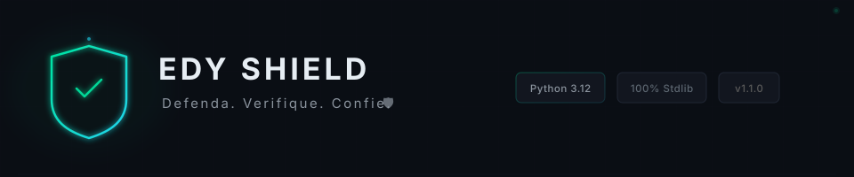
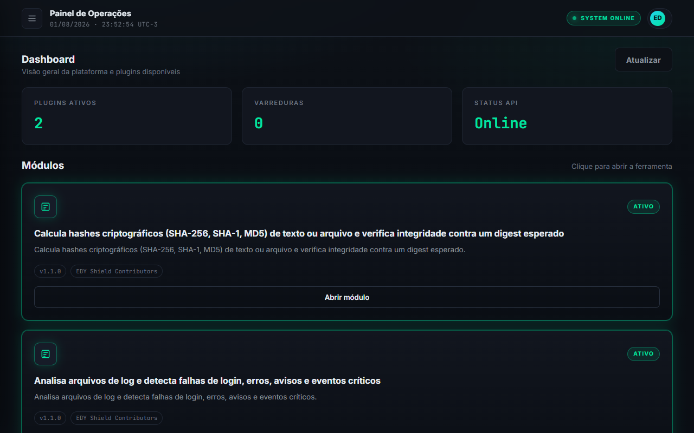
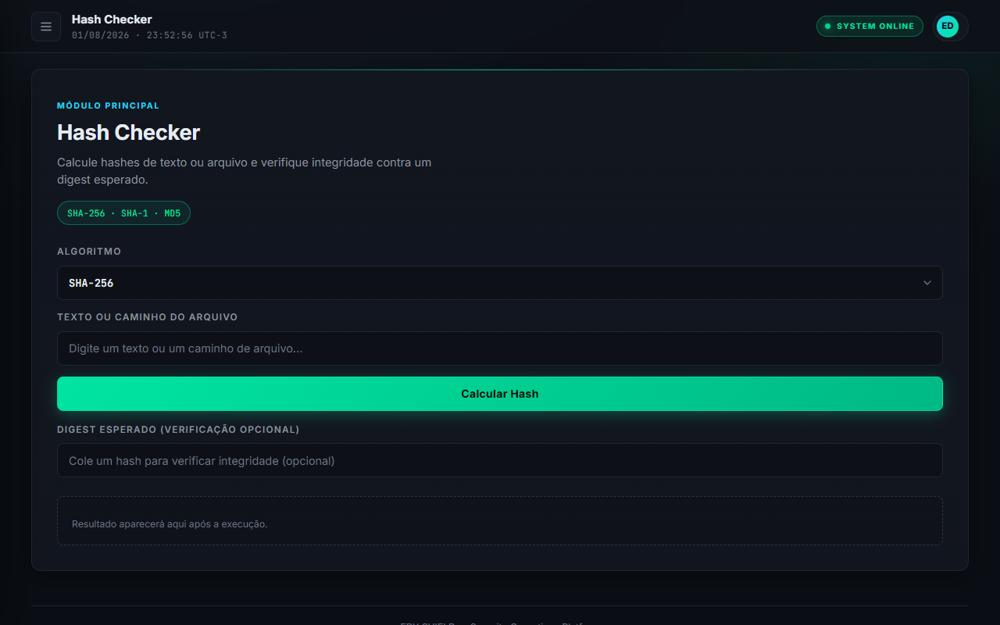
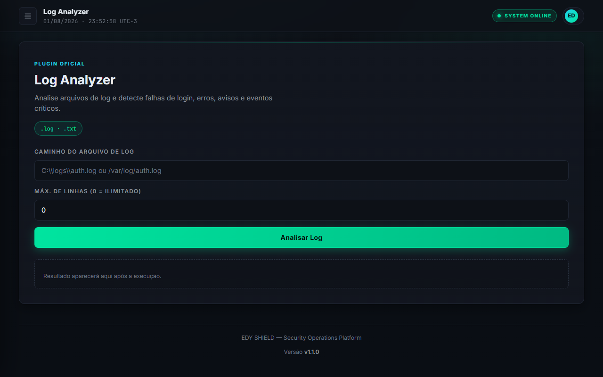
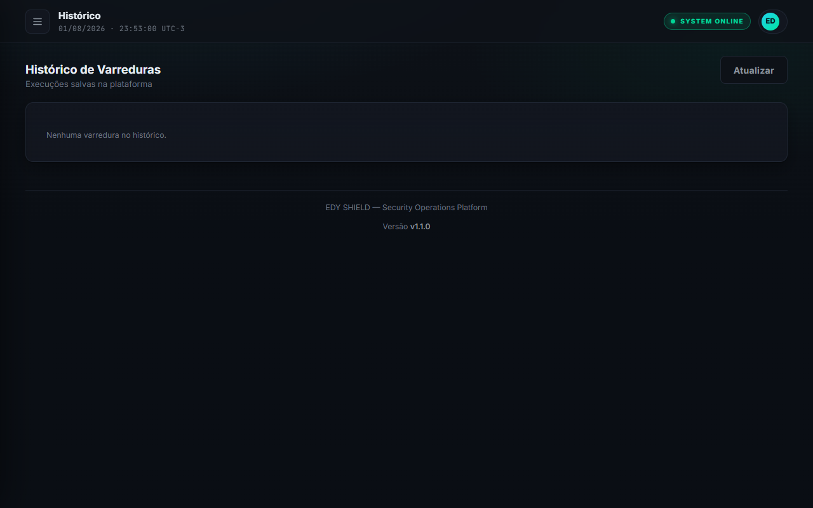
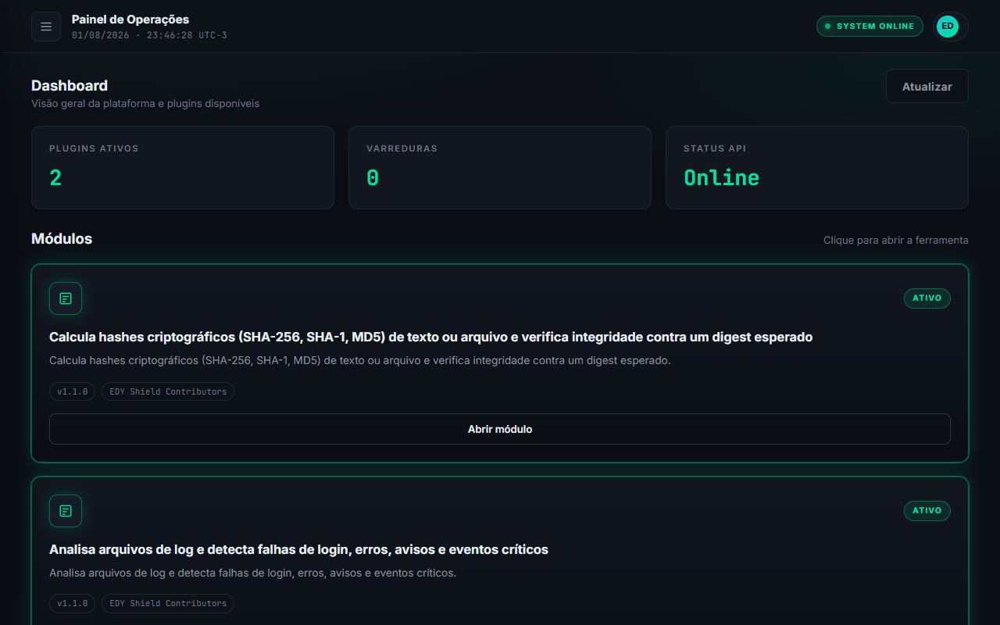

<p align="center">
  
</p>

<h1 align="center">🛡️ EDY Shield</h1>

<p align="center">
  <b>Modern Defensive Security Toolkit</b> for file integrity, hash analysis and incident investigation.
</p>

<p align="center">
  Plataforma modular de cibersegurança defensiva em <b>Python 3.12</b> — 100% biblioteca padrão no core.
  Hash Checker, Log Analyzer e framework de plugins com UI web dark para análise de integridade e forense.
</p>

<p align="center">
  <i>Defenda. Verifique. Confie.</i>
</p>

<p align="center">
  <a href="https://www.python.org/downloads/"></a>
  <a href="https://github.com/EDY075/edy-shield/releases"></a>
  <a href="LICENSE"></a>
  <a href="https://github.com/EDY075/edy-shield/actions"></a>
  <a href="https://github.com/EDY075/edy-shield/releases"></a>
</p>

<p align="center">
  <a href="#funcionalidades"></a>
  <a href="#quality-gates"></a>
  <a href="#arquitetura"></a>
</p>

---

## 📑 Índice

<div align="center">

| | | |
|---|---|---|
| [👁️ Visão geral](#visão-geral) | [🏗️ Arquitetura](#arquitetura) | [✨ Funcionalidades](#funcionalidades) |
| [📦 Instalação](#instalação) | [🚀 Uso rápido](#uso-rápido) | [📸 Screenshots](#screenshots) |
| [🎬 Demo](#demo) | [✅ Quality Gates](#quality-gates) | [🗺️ Roadmap](#roadmap) |
| [📁 Estrutura de pastas](#estrutura-de-pastas) | [🤝 Contribuição](#contribuição) | [📄 Licença](#licença) |
| [⚠️ Aviso de segurança](#aviso-de-segurança) | | |

</div>

---

## 👁️ Visão geral

**EDY Shield** é uma plataforma modular de segurança defensiva construída em **Python 3.12**, sem
dependências de terceiros no núcleo. O módulo **v1 — Hash Checker** calcula e verifica hashes
(SHA-256, SHA-1 e MD5) de textos, bytes e arquivos de forma rápida, tipada e segura — usando
apenas a biblioteca padrão (`hashlib`).

A arquitetura segue camadas unidirecionais (`ui → services → core`), o que mantém o
domínio puro, testável e independente de qualquer interface. O núcleo é **100% stdlib**: zero
pacotes externos, zero superfície de ataque por supply chain (ADR-001).

A **Sprint 2** entregou a fundação técnica: core refatorado em camadas por responsabilidade
(`config`, `crypto`, `exceptions`, `filesystem`, `logging`, `validators`), **CLI real**
(`edyshield hash|verify` via argparse), configuração por variáveis de ambiente `EDY_*` e
logging centralizado.

A **Sprint 3** tornou a plataforma extensível: **arquitetura de plugins** (`app/plugins`) com
contratos tipados e `PluginManager`, dois plugins oficiais (`log_analyzer` e `hash_checker`),
**Report Engine** (JSON/TXT/HTML), histórico persistido em disco e uma **UI web dark (painel
SOC)** servida por um servidor HTTP 100% stdlib (`app/ui/server.py`) que consome os plugins
**somente via PluginManager** — a UI nunca toca o Core diretamente.

<div align="center">

📚 **Documentação de referência:** [`docs/ARCHITECTURE.md`](docs/ARCHITECTURE.md) · [`docs/API_STABILITY.md`](docs/API_STABILITY.md) · [`SECURITY.md`](SECURITY.md) · [`docs/THREAT_MODEL.md`](docs/THREAT_MODEL.md)

</div>

---

## 🏗️ Arquitetura

O EDY Shield segue uma **arquitetura em camadas unidirecionais** (ADR-002), do domínio puro
para a interface — o Core é **100% stdlib** (ADR-001), testável e independente de qualquer
infraestrutura:

<div align="center">

| Camada | Componentes |
|--------|-------------|
| 🖥️ **UI** | `cli/hash_cmd.py` · `ui/server.py` · `ui/static/` |
| ⚙️ **Services** | `file_utils.py` (shim) · `report_engine.py` · `history.py` |
| 🧩 **Plugins** | `contracts.py` · `plugin_base.py` · `plugin_manager.py` · `plugin_registry.py` · `builtin/{log_analyzer, hash_checker_plugin}` |
| 🧠 **Core** | `algorithms/` · `crypto/` · `filesystem/` · `validators/` · `exceptions/` · `config/` · `logging/` · `models/` |

</div>

```
UI Layer      → cli/hash_cmd.py · ui/server.py · ui/static/
                  ↓
Service Layer → services/file_utils.py (shim) · report_engine.py · history.py
                  ↓
Plugin Layer  → plugins/contracts.py · plugin_base.py · plugin_manager.py · plugin_registry.py
                plugins/builtin/{log_analyzer.py, hash_checker_plugin.py}
                  ↓
Core Layer    → algorithms/hash_checker.py
                crypto/hashing.py · filesystem/safe_path.py · validators/input.py
                exceptions/domain.py · config/settings.py · logging/logger.py · models/
```

### Princípios arquiteturais

| Princípio | Aplicação |
|-----------|-----------|
| **Direção única** | `ui → services → core` — nunca inversa (ADR-002) |
| **Core puro** | 100% stdlib, zero deps runtime (ADR-001) |
| **Plugins cidadãos** | Expostos via `PluginManager` — mesma via para todos os módulos |
| **Fronteira de segurança única** | `resolve_safe_path()` valida todos os paths (ARES-QA-001) |
| **Erros de domínio** | Hierarquia `EDYShieldError` → `HashError`/`ValidationError`/`FilesystemError` |
| **Comparação constante** | `hmac.compare_digest` em toda comparação de hashes (ARES-QA-003) |

### Decisões de arquitetura (ADRs)

Todos os **8 ADRs** estão documentados em [`docs/adr/`](docs/adr/) — do Core 100% stdlib
(ADR-001) à configuração via ambiente `EDY_*` (ADR-008).

---

## ✨ Funcionalidades

<div align="center">

| 🧮 Hash Checker | 🧩 Plugins | 📊 Reports | 🖥️ Console |
|-----------------|------------|------------|-------------|
| SHA-256 · SHA-1 · MD5 | Contratos tipados + Manager | JSON · TXT · HTML | UI web dark (SOC) |

</div>

### Hash Checker (v1)

- 🔐 Cálculo de hash **SHA-256** (padrão recomendado), **SHA-1** e **MD5**;
- 📝 Entradas flexíveis: **texto**, **bytes** ou **arquivo**;
- 🗂️ Leitura de arquivos em **chunks** (64 KB) — ideal para arquivos grandes, sem estourar memória;
- ✅ Verificação de integridade (`verify_file`) com comparação **constante**
  (`hmac.compare_digest`) e case-insensitive;
- 🧬 Dispatcher estruturado (`compute`) que retorna um `HashResult` imutável com metadados
  (algoritmo, digest, origem, tamanho e caminho absoluto);
- 🛂 **Whitelist de algoritmos** — nomes arbitrários são rejeitados antes de chegar ao `hashlib`
  (mitigação de abuso de entrada);
- 🔒 **Fronteira única de paths** — `resolve_safe_path` + `ensure_regular_file` bloqueiam
  path traversal (`..`, absolutos fora da raiz, symlinks que escapam) e arquivos especiais;
- 🖥️ **CLI real** — `edyshield hash` e `edyshield verify` (argparse, stdlib);
- ⚙️ **Configuração por ambiente** — `EDY_DEFAULT_HASH_ALGORITHM`, `EDY_LOG_LEVEL`,
  `EDY_ALLOWED_ROOT`, `EDY_CHUNK_SIZE`, `EDY_TEXT_ENCODING`;
- 📋 **Logging centralizado** — logger `edy_shield` em stderr (nunca loga conteúdo de arquivo);
- 🪶 **Zero dependências** no core — só stdlib (`hashlib`, `hmac`, `dataclasses`, `enum`,
  `pathlib`, `argparse`, `logging`);
- 🧪 Suite de testes: **196 passed, 2 skipped** · cobertura **92.90%** · mypy strict 0 issues.

### Plugin Framework (Sprint 3)

- 🧩 **Arquitetura de plugins** com contratos tipados (`ScanContext`, `ScanResult`, `Evidence`,
  `Severity`) e hierarquia própria de erros (`PluginError`);
- 🗂️ **PluginManager** — registro, validação, execução isolada e tradução de falhas em
  `PluginExecutionError`; a UI e a CLI futura consomem os plugins **sempre** por esta via;
- 📜 **Log Analyzer** — detecta `FAILED LOGIN`, `SUCCESS LOGIN`, `ERROR`, `WARNING` e
  `CRITICAL` em arquivos `.log`/`.txt`, com estatísticas e janela de tempo;
- 🔐 **Hash Checker como plugin** — envolve a API pública do Core (`compute`/`verify_file`)
  sem duplicar lógica de negócio;
- 🛂 **Fronteira de paths nos plugins** — cada plugin revalida o alvo com
  `resolve_safe_path` (padrão ARES-QA-028: raiz efetiva = diretório pai do alvo).

### Report Engine & Histórico (Sprint 3)

- 📊 **Relatórios** em JSON, TXT e HTML (com escaping anti-XSS via `html.escape`);
- 💾 **HistoryStore** — persistência de varreduras em disco (`~/.edyshield/history`),
  listagem ordenada e proteção contra path traversal no id.

### UI Web — EDY Shield Console (Sprint 3)

- 🖥️ **Servidor HTTP 100% stdlib** (`ThreadingHTTPServer`) — zero dependências;
- 🎛️ **Painel dark (SOC)** com views: Dashboard, Hash Checker, Log Analyzer, Histórico,
  Relatórios e Módulos;
- 🔌 **API JSON** consumida pelo frontend (`/api/plugins`, `/api/scan`, `/api/history`,
  `/api/report`) — a UI **não** contém lógica de negócio.

### Roadmap de módulos

- 📊 **File Integrity Monitor** (baseline + detecção de mudanças) — *planejado (v2)*;
- 🔍 **String Analyzer / Entropy** (detecção de strings suspeitas) — *planejado (v2)*;
- 📈 **Dashboard Streamlit** integrando os módulos — *planejado (v2)*;
- 🖥️ **EDY Shield Console** — UI web unificada (Hash, Monitor, Scanner) — *entregue na Sprint 3*.

---

## 📦 Instalação

<div align="center">


</div>

### Requisitos

- **Python 3.12+** — [python.org/downloads](https://www.python.org/downloads/)
- `git` (para clonar o repositório)

> O core não exige nenhum pacote de terceiros. Tudo que é necessário para calcular hashes já está
> na biblioteca padrão.

### Opção A — uso direto do repositório

Como o core é 100% stdlib, basta clonar e executar a partir da raiz do projeto:

```bash
# 1. Clone o repositório
git clone https://github.com/EDY075/edy-shield.git
cd edy-shield

# 2. (Opcional, mas recomendado) crie um ambiente virtual
python -m venv .venv
# Windows:
.venv\Scripts\activate
# Linux/macOS:
source .venv/bin/activate

# 3. Instale as dependências de desenvolvimento (testes, lint, type check)
pip install -r requirements-dev.txt

# 4. Execute a partir da raiz do projeto (os imports usam o pacote `app`)
python -c "from app.core.algorithms import compute_text; print(compute_text('hello', 'sha256'))"
# 2cf24dba5fb0a30e26e83b2ac5b9e29e1b161e5c1fa7425e73043362938b9824
```

### Opção B — instalação em modo editable (CLI `edyshield`)

O empacotamento está configurado (`pyproject.toml`, PEP 621 + setuptools) e o entrypoint
`edyshield` é **funcional**:

```bash
pip install -e .
edyshield --version      # edyshield 1.1.0
edyshield --help
```

> O `pip install -e .` instala o projeto **local**, não um pacote publicado no PyPI.

---

## 🚀 Uso rápido

### CLI — `edyshield`

```bash
# Calcular o hash de um arquivo
edyshield hash relatorio.pdf
# 7f83b1657ff1fc53b92dc18148a1d65dfc2d4b1f...

# Calcular com algoritmo específico
edyshield hash backup.tar.gz --algorithm SHA256

# Verificar integridade (saída OK/FAIL, exit code 0/1)
edyshield verify backup.tar.gz --expected 7f83b1657ff1fc53b92dc18148a1d65dfc2d4b1f...
# OK

# Verificação que falha → exit code 1
edyshield verify backup.tar.gz --expected 0000...
# FAIL

# Restringir a raiz permitida (fronteira de paths)
edyshield hash docs/ARCHITECTURE.md --root docs
```

> Saída (digest/OK/FAIL) vai para **stdout**; logs e erros vão para **stderr**.
> Quando `--root` não é informado, a raiz permitida é o diretório pai do arquivo alvo.

### 1. Hash de texto

```python
from app.core.algorithms import compute_text

digest: str = compute_text("hello", "sha256")
print(digest)
# 2cf24dba5fb0a30e26e83b2ac5b9e29e1b161e5c1fa7425e73043362938b9824
```

### 2. Hash de arquivo (lido em chunks)

```python
from pathlib import Path

from app.core.algorithms import HashAlgorithm, compute_file

path: Path = Path("relatorio.pdf")
digest: str = compute_file(path, HashAlgorithm.SHA256)
print(digest)
```

O algoritmo aceita strings flexíveis (`"sha256"`, `"SHA-256"`, `"Sha1"`, `"MD5"`) ou membros do
enum `HashAlgorithm`. Nomes fora da whitelist geram `UnsupportedAlgorithmError`.

### 3. Verificação de integridade

```python
from pathlib import Path

from app.core.algorithms import verify_file

path: Path = Path("backup.tar.gz")
expected: str = "2cf24dba5fb0a30e26e83b2ac5b9e29e1b161e5c1fa7425e73043362938b9824"

if verify_file(path, expected, "sha256"):
    print("✔ Integridade OK — arquivo íntegro")
else:
    print("✘ MISMATCH — arquivo modificado ou corrompido")
```

### 4. Dispatcher estruturado (`compute`)

```python
from app.core.algorithms import HashAlgorithm, compute
from app.core.models import HashResult

result: HashResult = compute("hello", HashAlgorithm.SHA256)

print(result.algorithm)  # "SHA256"
print(result.hexdigest)  # 2cf24dba5fb0a30e26e83b2ac5b9e29e1b161e5c1fa7425e73043362938b9824
print(result.source)  # "text"  | "file" | "bytes"
print(result.size_bytes)  # 5
print(result.path)  # None (source != "file")
```

O dispatcher decide automaticamente a origem: `bytes` → hash direto, `Path` → hash de arquivo,
`str` → arquivo se o caminho existir, senão texto (strings que parecem path e não existem
lançam `FileNotFoundError` — sem fallback silencioso).

### 5. Algoritmos suportados

```python
from app.core.algorithms import supported_algorithms

print(supported_algorithms())
# ['SHA256', 'SHA1', 'MD5']
```

### 6. Configuração por ambiente

```bash
# Linux/macOS:
export EDY_DEFAULT_HASH_ALGORITHM=SHA256
export EDY_LOG_LEVEL=DEBUG
export EDY_ALLOWED_ROOT=/dados/projeto
export EDY_CHUNK_SIZE=131072
export EDY_TEXT_ENCODING=utf-8
# Windows (PowerShell):
$env:EDY_DEFAULT_HASH_ALGORITHM="SHA256"
```

---

## 📸 Screenshots

> Interface web dark (painel SOC) do EDY Shield Console em execução local (`http://127.0.0.1:8000`).

| | |
|---|---|
|  |  |
|  |  |

---

## 🎬 Demo

> GIF demonstrativo do EDY Shield Console — navegação entre Dashboard, Hash Checker, Log Analyzer, Histórico, Relatórios e Módulos.



---

## ✅ Quality Gates

Todo código do EDY Shield passa obrigatoriamente pelos seguintes gates antes de merge (CI
GitHub Actions + local):

| Gate | Comando | Requisito | Status v1.1.0 |
|------|---------|-----------|---------------|
| 🧪 **Testes** | `pytest` | 100% passando | ✅ 196 passed, 2 skipped |
| 📊 **Cobertura** | `pytest --cov=app` | ≥ 90% | ✅ 92.90% |
| 🔍 **Tipos** | `mypy app --strict` | 0 issues | ✅ 0 issues (38 arquivos) |
| 🧹 **Lint** | `ruff check .` | All checks passed | ✅ Pass |
| 🎨 **Formatação** | `ruff format --check .` | 100% formatado | ✅ 57 files OK |
| 🔒 **Segurança** | Revisão ARES (QA_REPORT) | 0 Critical/High | ✅ 0 abertos |

> Cobertura medida em `app/` (gate `--cov-fail-under=90` no `pyproject.toml`).
> Detalhes de QA: [`docs/QA_REPORT.md`](docs/QA_REPORT.md).

---

## 🗺️ Roadmap

| Versão | Status | Objetivo | Previsão |
|--------|--------|----------|----------|
| **v0.1.0** | ✅ Concluído | Fundação técnica — Core em camadas, CLI real, config `EDY_*`, path safety | Sprint 2 |
| **v1.1.0** | 🚀 **Release** | TOCTOU hardening, exit codes 0/1/2, ADRs 001-008, dev deps pinadas | Sprint 3 |
| **v1.2** | ⬜ Planejado | Estabilização — Hash Checker batch, checksum files, E2E via CLI | Próxima |
| **v2.0** | ⬜ Planejado | Plataforma — File Integrity Monitor, String Analyzer, dashboard Streamlit | Futuro |
| **v2.1** | ⬜ Planejado | Inteligência — baseline SQLite, alertas, blacklist pública (opt-in) | Futuro |
| **v3.0** | ⬜ Planejado | Plataforma completa — Console web unificado, API REST, `pip install edy-shield` | Futuro |

### v0.1.0 — Fundação técnica ✅ (Sprint 2)

- [x] Core refatorado em camadas por responsabilidade (`config`, `crypto`, `exceptions`,
      `filesystem`, `logging`, `report`, `validators`, `utils`)
- [x] CLI real `edyshield hash|verify` via argparse (stdlib) — entrypoint instalável
- [x] Configuração via `Settings` (dataclass frozen) + variáveis `EDY_*`
- [x] Logging centralizado (logger `edy_shield`, stderr, idempotente)
- [x] Hierarquia de exceções de domínio (`EDYShieldError` → `HashError`/`ValidationError`/
      `FilesystemError`)
- [x] Fronteira de paths migrada para o core (`resolve_safe_path` + `ensure_regular_file`)
- [x] CI completo (pytest → mypy → ruff check → ruff format --check)
- [x] Testes: 101 passed, 2 skipped · Cobertura 99.34% · mypy strict 0 issues

### v1.0 — Estabilização ⬜

- [x] Validação anti path traversal + testes de segurança *(implementado na v0.1.0)*
- [x] CI completo (lint + mypy + coverage gate) *(implementado na v0.1.0)*
- [ ] Cobertura de integração E2E via CLI (expansão além dos testes unitários atuais)
- [ ] Comparação de integridade em lote (batch)
- [ ] Suporte a checksum files (`.sha256sum` / `.md5sum`)
- [ ] TOCTOU hardening na camada de serviço (`os.open` + `O_NOFOLLOW` + `fstat`)
- [ ] Pinning/lockfile de dev deps (ARES-QA-022)

### v2.0 — Plataforma de Ferramentas ⬜

- [ ] Módulo **File Integrity Monitor** (baseline + detecção de mudanças)
- [ ] Módulo **String Analyzer / Entropy** (detecção de strings suspeitas)
- [ ] Dashboard **Streamlit** integrando os módulos
- [ ] Relatórios exportáveis (JSON/Markdown) — `app/core/report/` (reservado)
- [ ] Arquitetura de plugins (register/decorator)

### v3.0 — Plataforma Completa ⬜

- [ ] **EDY Shield Console** — UI web dark unificada (Hash, Monitor, Scanner)
- [ ] Scanner de arquivos em lote com relatório de risco
- [ ] API REST leve (FastAPI) opcional para integração
- [ ] Modo agente (agendador de verificações)
- [ ] Documentação completa + testes E2E + release notes
- [ ] Empacotamento `pip install edy-shield` + executável

---

## 📁 Estrutura de pastas

```text
EDYShield/
├── app/
│   ├── __init__.py                # __version__ = "1.1.0"
│   ├── cli/                       # INTERFACE CLI (argparse, stdlib)
│   │   └── hash_cmd.py            # edyshield hash|verify (entrypoint main)
│   ├── core/                      # DOMÍNIO PURO — 100% stdlib, sem UI
│   │   ├── algorithms/            # API pública (8 símbolos)
│   │   │   └── hash_checker.py    # compute/compute_bytes/compute_text/compute_file/verify_file
│   │   ├── config/                # Settings (frozen) + load_settings (env EDY_*)
│   │   │   └── settings.py
│   │   ├── crypto/                # HashAlgorithm, normalize_algorithm, new_hasher, safe_compare
│   │   │   └── hashing.py
│   │   ├── exceptions/            # EDYShieldError → HashError/ValidationError/FilesystemError
│   │   │   └── domain.py
│   │   ├── filesystem/            # Fronteira única de paths (safe_path)
│   │   │   └── safe_path.py       # resolve_safe_path, ensure_regular_file
│   │   ├── logging/               # setup_logging (idempotente), get_logger
│   │   │   └── logger.py
│   │   ├── models/                # HashResult, HashSource (+ shim de erros)
│   │   │   ├── hashes.py
│   │   │   └── common.py          # shim → exceptions.domain
│   │   ├── report/                # RESERVADO — sem código (roadmap v2.0)
│   │   ├── validators/            # validate_chunk_size, validate_expected
│   │   │   └── input.py
│   │   └── utils/                 # RESERVADO — sem código
│   ├── services/                  # CASOS DE USO (shim de segurança de paths)
│   │   └── file_utils.py          # shim → core.filesystem.safe_path
│   └── ui/
│       └── static/                # Interface web dark (painel SOC)
│           ├── index.html
│           └── css/style.css
├── tests/
│   └── unit/                      # Testes unitários (hash, file_utils, core_layers,
│                                  #   cli, config, logging)
├── docs/
│   ├── ARCHITECTURE.md            # Arquitetura de referência
│   ├── API_STABILITY.md           # Contrato de estabilidade da API
│   ├── THREAT_MODEL.md            # Modelo de ameaças formal
│   ├── QA_REPORT.md               # Relatório de QA & Segurança (ARES)
│   └── adr/                       # Architecture Decision Records (ADR-006..008)
├── .github/
│   └── workflows/ci.yml           # CI: pytest → mypy → ruff check → ruff format --check
├── pyproject.toml                 # PEP 621 + setuptools (v1.1.0)
├── requirements-dev.txt           # pytest, pytest-cov, mypy, ruff
├── SECURITY.md                    # Política de segurança
├── CONTRIBUTING.md                # Guia de contribuição
├── CHANGELOG.md                   # Keep a Changelog
├── LICENSE                        # MIT (2026, EDY Shield Contributors)
└── README.md
```

> A visão expandida (camadas, fluxos e decisões de arquitetura) está detalhada em
> [`docs/ARCHITECTURE.md`](docs/ARCHITECTURE.md).

---

## 🤝 Contribuição

Contribuições são bem-vindas! Veja o guia completo em [`CONTRIBUTING.md`](CONTRIBUTING.md).

<div align="center">

| 🍴 Fork | 🧪 Testes | 🚀 Pull Request |
|---------|-----------|-----------------|
| Crie uma branch a partir de `main` | Todo código novo com cobertura unitária | Descreva a mudança e o impacto |

</div>

Fluxo resumido:

1. **Fork** o repositório e crie uma branch a partir de `main`:
   ```bash
   git checkout -b feat/minha-melhoria
   ```
2. Implemente a mudança **com testes** — todo código novo deve ter cobertura unitária;
3. Execute o pipeline de qualidade localmente:
   ```bash
   pip install -e ".[dev]"
   pytest
   mypy app
   ruff check .
   ruff format --check .
   ```
4. Use **Conventional Commits**:
   ```text
   feat: adiciona verificação em lote de checksums
   fix: corrige validação de path traversal
   docs: atualiza roadmap e API stability
   ```
5. Abra um **Pull Request** descrevendo a mudança, os testes executados e o impacto.

**Requisitos para merge:**

- [ ] Testes passando (`pytest`) com cobertura ≥ 90%
- [ ] `mypy` estrito sem erros
- [ ] `ruff check` sem warnings + `ruff format --check` OK
- [ ] Sem dependências de terceiros no core (ADR-001)
- [ ] Documentação atualizada quando aplicável

---

## 📄 Licença

Distribuído sob a licença **MIT**. Veja o arquivo [`LICENSE`](LICENSE) para mais detalhes.

---

## ⚠️ Aviso de segurança

> **Uso educacional e autorizado.** O EDY Shield é uma ferramenta **defensiva** de cibersegurança
> destinada a fins educacionais, de pesquisa e de análise de integridade em sistemas **próprios ou
> com autorização expressa** do proprietário.

<div align="center">

| 🔓 Algoritmos legados | 🛡️ Recomendado | 🚨 Vulnerabilidades | 🚫 Responsabilidade |
|-----------------------|-----------------|---------------------|---------------------|
| MD5/SHA-1: compatibilidade legada | SHA-256: padrão | Reporte privado | Uso exclusivo do responsável |

</div>

- 🔓 **MD5 e SHA-1 não são criptograficamente seguros** para resistência a colisões. Eles são
  fornecidos apenas para **compatibilidade legada** e devem ser usados **exclusivamente em
  verificações de integridade não críticas** (ex.: conferir um checksum antigo). O core emite
  um `DeprecationWarning` em runtime quando são usados (ARES-QA-004).
- 🛡️ O **SHA-256** é o algoritmo padrão recomendado para integridade e autenticação de arquivos.
- 🚨 Encontrou uma vulnerabilidade? Reporte de forma **privada** — veja [`SECURITY.md`](SECURITY.md)
  (divulgação responsável, sem disclosure público antes do fix).
- 🚫 O uso indevido, não autorizado ou mal-intencionado desta ferramenta é de responsabilidade
  exclusiva de quem a utiliza. Os autores não se responsabilizam por danos decorrentes do mau uso.

---

<div align="center">

**EDY Shield** — Defenda. Verifique. Confie. 🛡️

*Plataforma modular de cibersegurança defensiva · Python 3.12 · 100% stdlib no core*

---

**[🔗 GitHub Repository](https://github.com/EDY075/edy-shield) · [📖 Documentação](docs/ARCHITECTURE.md) · [🛡️ Reportar vulnerabilidade](SECURITY.md)**

Built with **Python 3.12** · **MIT License** · Made with ❤️ by [EDY075](https://github.com/EDY075)

</div>
