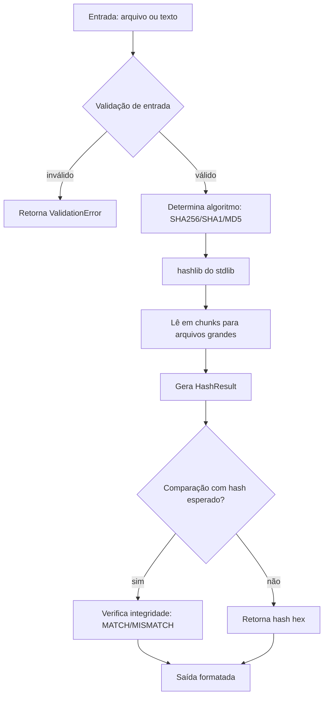

# 🛡️ EDY SHIELD — Arquitetura de Referência

> **Tech Lead:** jr (CyberShield AI) · **Arquiteto:** ATLAS
> **Versão:** 2.0.0-dev (identidade visual v1.0) · **Status:** EM DESENVOLVIMENTO
> **Data:** 02/08/2026 · *Identidade visual oficial: `brand/` (Escudo Verificado + Monograma E+Hash)*

---

## 1. Visão Geral

**EDY Shield** é uma plataforma modular de cibersegurança defensiva, construída em **Python 3.12**,
com módulos especializados (Hash Checker, e futuros: Scanner, Monitor, Forense), interface
minimalista dark, e uma arquitetura que cresce de **módulo único → toolkit → plataforma**.

**Princípios arquiteturais:**

| Princípio | Aplicação |
|---|---|
| Modularidade | Cada ferramenta é um módulo isolado e testável |
| Camadas | Core (domínio) ↔ Services (casos de uso) ↔ UI (apresentação) |
| Tipagem forte | `typing` + `dataclasses` + mypy estrito |
| Segurança-first | Entradas validadas, sem execução insegura, path traversal mitigado |
| Estático primeiro | Sem backend obrigatório; UI em HTML/CSS ou Streamlit |
| Testável | Cobertura unitária ≥ 80% por módulo |

---

## 2. Estrutura de Pastas

> Estrutura **real** do código (v0.1.0, Sprint 2). Itens que antes eram planejados e não
> existiam (ex.: `main.py`, `core/interfaces/`, `services/hash_service.py`,
> `ui/streamlit_app.py`, `docs/ROADMAP.md`, `requirements.txt`, `.env.example`) **não existem**
> e foram removidos desta árvore.

```text
EDYShield/
├── app/
│   ├── __init__.py                 # __version__ = "2.0.0"
│   ├── cli/                        # INTERFACE CLI (argparse, stdlib — ADR-007)
│   │   ├── __init__.py
│   │   └── hash_cmd.py             # Comandos hash|verify (entrypoint `edyshield`)
│   ├── core/                       # DOMÍNIO PURO — 100% stdlib, sem UI/CLI (ADR-001)
│   │   ├── __init__.py
│   │   ├── algorithms/             # API pública do Hash Checker (8 símbolos)
│   │   │   ├── __init__.py
│   │   │   └── hash_checker.py     # compute/compute_bytes/compute_text/compute_file/verify_file
│   │   ├── config/                 # Configuração (ADR-008)
│   │   │   ├── __init__.py
│   │   │   └── settings.py         # Settings (frozen) + load_settings (env EDY_*)
│   │   ├── crypto/                 # Primitivas criptográficas (whitelist, safe_compare)
│   │   │   ├── __init__.py
│   │   │   └── hashing.py          # HashAlgorithm, normalize_algorithm, new_hasher
│   │   ├── exceptions/             # Hierarquia de erros de domínio (ADR-005)
│   │   │   ├── __init__.py
│   │   │   └── domain.py           # EDYShieldError → HashError/ValidationError/FilesystemError/FimError
│   │   ├── filesystem/             # Fronteira única de segurança de paths
│   │   │   ├── __init__.py
│   │   │   ├── safe_path.py        # resolve_safe_path, ensure_regular_file
│   │   │   └── opener.py           # open_regular_file (TOCTOU hardening — v1.2)
│   │   ├── fim/                    # File Integrity Monitor (Sprint 5 — v2.0)
│   │   │   ├── __init__.py         # re-exports públicos do FIM
│   │   │   ├── models.py           # Baseline, BaselineEntry, Snapshot, FimDiff, ChangeType
│   │   │   ├── ids.py              # build_baseline_id
│   │   │   ├── scanner.py          # scan_snapshot, compare_baseline_snapshot
│   │   │   ├── baseline.py         # create_baseline, load_baseline, save_baseline
│   │   │   └── store.py            # FimStore (~/.edyshield/fim)
│   │   ├── logging/                # Logging centralizado (Missão 3)
│   │   │   ├── __init__.py
│   │   │   └── logger.py           # setup_logging (idempotente), get_logger
│   │   ├── storage/                # Persistência SQLite (v2.1 — M1)
│   │   │   ├── __init__.py         # re-exports (SQLiteDb, DEFAULT_DB_PATH)
│   │   │   └── sqlite_db.py        # SQLiteDb: conexão thread-safe + schema + transações
│   │   ├── models/                 # Dataclasses, enums, tipos
│   │   │   ├── __init__.py
│   │   │   ├── hashes.py           # HashResult, HashSource
│   │   │   └── common.py           # shim → exceptions.domain (HashError, UnsupportedAlgorithmError)
│   │   ├── report/                 # RESERVADO — estrutura criada, sem código (roadmap v2.0)
│   │   │   └── __init__.py
│   │   ├── validators/             # Validação de entrada (Missão 2)
│   │   │   ├── __init__.py
│   │   │   └── input.py            # validate_chunk_size, validate_expected
│   │   └── utils/                  # RESERVADO — estrutura criada, sem código
│   │       └── __init__.py
│   ├── services/                   # CASOS DE USO — shim de segurança de paths (Missão 2)
│   │   ├── __init__.py             # re-export resolve_safe_path/validate_allowed_root
│   │   └── file_utils.py           # shim → core.filesystem.safe_path
│   └── ui/                         # INTERFACE GRÁFICA
│       └── static/                 # Interface dark standalone (sem lógica sensível)
│           ├── index.html
│           └── css/style.css
├── tests/
│   ├── __init__.py
│   ├── conftest.py                 # Fixtures compartilhadas (sys.path)
│   └── unit/
│       ├── test_hash_checker.py    # 48 testes (Hash Checker + segurança negativa)
│       ├── test_file_utils.py      # 15 testes (fronteira de caminhos)
│       ├── test_core_layers.py     # 15 testes (camadas do core)
│       ├── test_cli.py             # CLI real (hash/verify/--version/--help)
│       ├── test_config.py          # Settings + load_settings
│       └── test_logging.py         # setup_logging/get_logger
├── docs/
│   ├── ARCHITECTURE.md             # Este documento
│   ├── API_STABILITY.md            # Contrato de estabilidade da API pública
│   ├── THREAT_MODEL.md             # Modelo de ameaças formal
│   ├── QA_REPORT.md                # Relatório de QA & Segurança (ARES)
│   └── adr/                        # Architecture Decision Records
│       ├── ADR-006.md              # Camadas do Core por responsabilidade
│       ├── ADR-007.md              # CLI via argparse com subcomandos
│       └── ADR-008.md              # Configuração via Settings + env EDY_*
├── .github/
│   └── workflows/
│       └── ci.yml                  # ✅ CI: pytest → mypy → ruff check → ruff format --check
├── scripts/                        # (vazio — sem scripts de bootstrap)
├── pyproject.toml                  # ✅ Build PEP 621 + tooling (pytest/mypy/ruff) — v1.1.0
├── requirements-dev.txt            # ✅ pytest, pytest-cov, mypy, ruff
├── SECURITY.md                     # Política de segurança
├── CONTRIBUTING.md                 # Guia de contribuição
├── CHANGELOG.md                    # Keep a Changelog
├── LICENSE                         # ✅ MIT (2026, EDY Shield Contributors)
└── README.md
```

---

## 3. Tecnologias

| Camada | Tecnologia | Justificativa |
|---|---|---|
| Linguagem | **Python 3.12** | Requisito do projeto; tipagem moderna, `pathlib`, `hashlib` |
| Domínio/Core | **stdlib (`hashlib`, `dataclasses`, `pathlib`)** | Zero dependências no núcleo — segurança e portabilidade |
| CLI | **`argparse`** (stdlib) ✅ IMPLEMENTADO (ADR-007) | Zero deps na v1; evolução para **Typer** fica como opção futura se a UX do CLI crescer |
| UI (v1) | **HTML/CSS/JS estático** (dark) | Requisito; leve, portátil, sem framework |
| UI (v2+) | **Streamlit** | Dashboards interativos de cibersegurança |
| Testes | **pytest + pytest-cov** | Padrão de mercado, fixtures, plugins |
| Qualidade | **mypy (estrito), ruff** | Tipagem verificada + lint rápido |
| Empacotamento | **pyproject.toml (PEP 621) + setuptools** | Build moderno, sem setup.py manual |
| Versionamento | **Git + Semantic Versioning** | Rastreabilidade entre releases |

> **Anti-dependências:** nada de numpy/pandas no core. Hashes são nativos do stdlib.
> A dependência só entra quando o caso de uso exigir (ex.: UI, relatórios).

---

## 4. Fluxograma

### 4.1 Fluxo funcional — Hash Checker (v1)



### 4.2 Arquitetura em camadas

```mermaid
flowchart LR
    subgraph UI
        CLI[CLI argparse — edyshield hash|verify] --- WEB[UI HTML/Streamlit]
    end
    subgraph Services
        SVC[services/file_utils — shim de paths]
    end
    subgraph Core
        ALG[core/algorithms — API pública]
        CRYPTO[core/crypto]
        FS[core/filesystem]
        VALID[core/validators]
        EXC[core/exceptions]
        CONF[core/config]
        LOG[core/logging]
        MOD[core/models]
    end
    subgraph Infra
        STD[stdlib: hashlib, hmac, pathlib, logging]
    end
    CLI --> SVC
    WEB --> SVC
    SVC --> ALG
    ALG --> CRYPTO
    ALG --> FS
    ALG --> VALID
    ALG --> EXC
    CRYPTO --> STD
    FS --> STD
    CONF --> LOG
    CLI --> CONF
    CLI --> LOG
```

### 4.3 Fluxo de dados (arquivo grande)

```text
Arquivo (chunk 64KB) ──▶ hashlib.update() ──▶ hexdigest()
                                                        │
Texto/bytes ──▶ hashlib.new(algo) ──▶ update(bytes) ──▶ hexdigest()
```

---

## 5. Dependências

### 5.1 Runtime (v1 — mínimas)

| Pacote | Versão | Uso |
|---|---|---|
| Python | ≥ 3.12 | Base |
| *(nenhuma de terceiros no core)* | — | `hashlib` é stdlib |

### 5.2 Runtime opcional (v2+)

| Pacote | Quando |
|---|---|
| `streamlit` | Dashboard interativo (v2) |
| `typer` | CLI rico com autocomplete (v2) |

### 5.3 Dev (obrigatório)

| Pacote | Versão sugerida | Uso |
|---|---|---|
| `pytest` | ≥ 8.x | Testes |
| `pytest-cov` | ≥ 5.x | Cobertura |
| `mypy` | ≥ 1.10 | Type checking estrito |
| `ruff` | ≥ 0.5 | Lint + format |

### 5.4 Regra de dependência

> **Direção única:** `ui → services → core → models`. Nada no core importa de `services` ou `ui`.
> Isso garante que o núcleo continue testável sem infraestrutura.

---

## 6. Boas Práticas

### Segurança
- [x] **Path traversal mitigado** — fronteira única no **Core** (`app/core/filesystem/safe_path.py`, Missão 2; `app/services/file_utils.py` virou shim): `resolve_safe_path()` resolve o caminho (incluindo symlinks via `Path.resolve()`) e valida contenção na raiz permitida com `relative_to`; `ensure_regular_file()` rejeita diretórios e arquivos especiais (FIFO/device/socket — mitigação de DoS, ARES-QA-007). `..` fora da raiz, absolutos fora dela e symlinks que escapam são bloqueados com `HashError("acesso negado: caminho fora do diretório permitido")` (ARES-QA-001). `allowed_root` é explícito por chamador; default = cwd (ou diretório pai do alvo na CLI)
- [x] Ler arquivos em **chunks** (evitar carregar GB em memória — mitigação de DoS local)
- [x] Usar `hashlib.new(algo)` com whitelist de algoritmos (nunca aceitar nome de algoritmo do usuário diretamente)
- [x] Comparação de hashes em tempo constante (`hmac.compare_digest` em `verify_file` — ARES-QA-003)
- [x] Nunca logar conteúdo do arquivo — apenas hashes
- [x] MD5/SHA1 **apenas para integridade não crítica**; SHA256 como padrão (`DeprecationWarning` emitido em runtime — ARES-QA-004)
- [x] Mensagens de erro sanitizadas — nunca expõem caminhos absolutos, apenas `target.name` (ARES-QA-005)
- [ ] (v2) Sandbox para análise de binários suspeitos

### Código
- [x] Type hints em 100% das funções públicas
- [x] Docstrings (Google style) em módulos, classes e funções públicas
- [x] Dataclasses para resultados (`HashResult`)
- [x] Erros de domínio customizados (`HashError`, `UnsupportedAlgorithmError`)
- [x] Nomenclatura sem abreviações ambíguas
- [x] Funções puras no core (sem estado global)

### Processo
- [x] Conventional Commits (`feat:`, `fix:`, `docs:`)
- [x] Testes unitários por módulo + 1 teste de integração E2E via CLI
- [x] CI (GitHub Actions) a partir da v1.0: lint → type → test → cov
- [x] PR obrigatório com QG (QA + ARES revisão)

---

## 7. Roadmap — v0.1.0 → v3.0

> Atualizado em 01/08/2026 (NOVA, Missão 4) para refletir a Sprint 2 concluída. A Sprint 2
> entregou a **fundação técnica v0.1.0** (Core em camadas, CLI real, config, logging, path
> safety no core, CI completo). Roadmap de referência no [`README.md`](../README.md).

### 🛡️ v0.1.0 — Fundação técnica (Sprint 2) ✅ IMPLEMENTADO
- [x] Core refatorado em camadas por responsabilidade (`config`, `crypto`, `exceptions`,
      `filesystem`, `logging`, `report`, `validators`, `utils`) — ADR-006
- [x] CLI real `edyshield hash|verify` via argparse (stdlib) — entrypoint instalável — ADR-007
- [x] Configuração via `Settings` (dataclass frozen) + variáveis `EDY_*` — ADR-008
- [x] Logging centralizado (logger `edy_shield`, stderr, idempotente)
- [x] Hierarquia de exceções de domínio (`EDYShieldError` → `HashError`/`ValidationError`/
      `FilesystemError`) — ADR-005
- [x] Fronteira de paths migrada para o core (`resolve_safe_path` + `ensure_regular_file`)
- [x] Testes: 101 passed, 2 skipped · Cobertura 99.34% · mypy strict 0 issues (25 arquivos) ·
      ruff limpo (36 arquivos formatados)

### 🚀 v1.0 — Fundação (Módulo Hash Checker)
- [x] Módulo `hash_checker.py` (SHA256, SHA1, MD5)
- [x] Tipagem + docstrings + testes unitários
- [x] CLI básico (arquivo/texto → hash → comparação) — ✅ evoluído para CLI real na v0.1.0
- [x] Interface HTML dark (visual, sem lógica)
- [x] README + CI básico
- [x] Empacotamento PEP 621 (`pyproject.toml`) + `LICENSE` MIT + `requirements-dev.txt`
- [x] Camada `services/file_utils.py` (fronteira única de validação de caminhos) — ✅ migrada
      para o Core na v0.1.0 (`core/filesystem`); services virou shim
- [x] Validação anti path traversal + testes de segurança (traversal, raiz, symlink, binários)
- [x] CI completo (GitHub Actions): pytest → mypy → ruff check → ruff format --check
- **Critério de saída:** 100% testes passando, cobertura core ≥ 90% (atual: **99.34%**), mypy
  strict 0 erros, ruff limpo

### 🛠️ v1.1 — Robustez
- [x] Validação anti path traversal + testes de segurança *(implementado na v0.1.0/Sprint 2)*
- [x] CI completo (lint + mypy + coverage gate) *(implementado na v0.1.0/Sprint 2)*
- [x] Entrypoint CLI real (`edyshield`) *(ARES-QA-021 resolvido na v0.1.0/Sprint 2)*
- [x] Core em camadas + config + logging *(Sprint 2 — ADR-006/007/008)*
- [ ] Cobertura de integração E2E via CLI (expansão além dos testes unitários atuais)
- [ ] Comparação de integridade com múltiplos arquivos (batch)
- [ ] Suporte a checksum file (`.sha256sum` / `.md5sum`)
- [ ] TOCTOU hardening na camada de serviço (open → `fstat` no handle; `O_NOFOLLOW`)
- [ ] Pinning/lockfile de dev deps (ARES-QA-022)

### 📊 v2.0 — Plataforma de Ferramentas ✅ (Sprint 5)
- [x] Módulo **File Integrity Monitor** (baseline + scan + compare) — `app/core/fim/`
- [x] Relatórios exportáveis (JSON/TXT/HTML/**Markdown**)
- [x] View **FIM** no Console SOC + endpoints `/api/fim/baselines`
- [x] CLI `edyshield fim baseline criar | scan`
- [ ] Módulo **String Analyzer / Entropy** (detecção de strings suspeitas) — *movido p/ v2.1*

### 🧠 v2.1 — Inteligência
- [ ] **String Analyzer** (detecção de strings suspeitas)
- [ ] **Entropy Analyzer** (detecção de alta entropia)
- [ ] Baseline de diretórios monitorados (banco local **SQLite**)
- [ ] **Alertas** (console/notificação)

### 🏆 v3.0 — Plataforma Completa
- [ ] **EDY Shield Console** — UI web dark unificada (Hash, Monitor, Scanner)
- [ ] Scanner de arquivos em lote com relatório de risco
- [ ] API REST leve (FastAPI) opcional para integração
- [ ] Modo agente (agendador de verificações)
- [ ] Documentação completa + testes E2E + release notes
- [ ] Empacotamento `pip install edy-shield` + executável

---

## 8. Contratos de Interface (v1)

### Port do serviço de hash (`hash_port.py`)
```python
class HashPort(Protocol):
    def compute(self, data: bytes, algorithm: str) -> str: ...
    def compute_file(self, path: Path, algorithm: str, chunk_size: int = 65536) -> str: ...
    def verify(self, path: Path, expected: str, algorithm: str) -> bool: ...
```

### Modelo de resultado
```python
@dataclass(frozen=True)
class HashResult:
    algorithm: str
    hexdigest: str
    source: str          # 'file' | 'text' | 'bytes'
    path: Path | None    # None se source != 'file'
    size_bytes: int | None
```

---

## 9. Decisões de Arquitetura (ADRs)

| ADR | Decisão | Motivo | Documento |
|---|---|---|---|
| ADR-001 | Core 100% stdlib | Segurança, portabilidade, zero supply-chain no núcleo | ✅ [`docs/adr/ADR-001.md`](adr/ADR-001.md) |
| ADR-002 | Camadas unidirecionais | Testabilidade e manutenção | ✅ [`docs/adr/ADR-002.md`](adr/ADR-002.md) |
| ADR-003 | UI estática v1 (HTML) → Streamlit v2 | Satisfaz requisito inicial sem acoplar | ✅ [`docs/adr/ADR-003.md`](adr/ADR-003.md) |
| ADR-004 | CLI via argparse na v1 | Zero dependências; Typer entra se UX CLI justificar | ✅ [`docs/adr/ADR-004.md`](adr/ADR-004.md) |
| ADR-005 | Erros de domínio customizados | CLI/UI traduzem; nunca vazam traceback | ✅ [`docs/adr/ADR-005.md`](adr/ADR-005.md) |
| ADR-006 | Camadas do Core por responsabilidade | Testabilidade, evolução, fronteira única de segurança | ✅ [`docs/adr/ADR-006.md`](adr/ADR-006.md) |
| ADR-007 | CLI via argparse (stdlib) com subcomandos | Zero deps runtime; entrypoint `edyshield`; exit 0/1/2 | ✅ [`docs/adr/ADR-007.md`](adr/ADR-007.md) |
| ADR-008 | Configuração via `Settings` + env `EDY_*` | Dataclass frozen, validação de tipos, sem arquivo de config | ✅ [`docs/adr/ADR-008.md`](adr/ADR-008.md) |

> **Status:** Todos os 8 ADRs estão documentados em `docs/adr/`.

---

## 10. Ambientes

| Ambiente | Uso | Configuração |
|---|---|---|
| `dev` | Desenvolvimento local | `requirements-dev.txt` |
| `test` | CI (GitHub Actions) | `pytest -m "not slow"` |
| `prod` | Distribuição | Build via `pyproject.toml` |

---

> **EDY Shield — Defenda. Verifique. Confie.**
> Documento gerado pelo TITAN AI SQUAD — jr (Tech Lead) + ATLAS (Arquiteto) · v1.0.0
