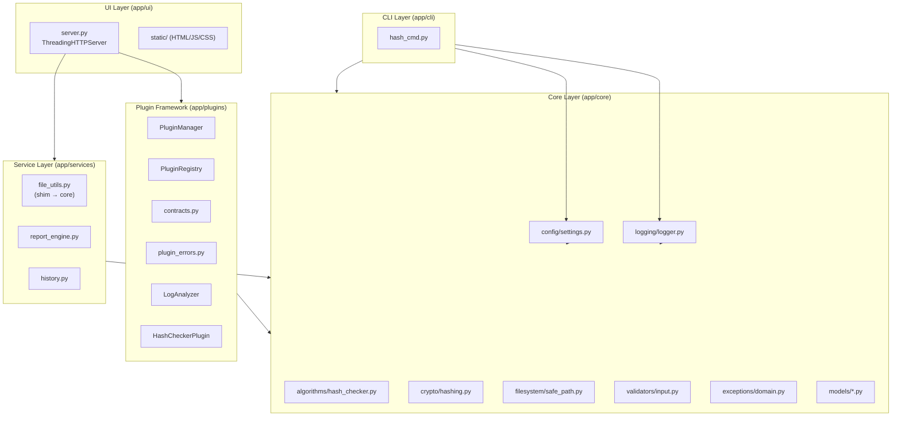

# 🏗️ EDY SHIELD — Auditoria Arquitetural Completa (v1.1)

> **Arquiteto:** ATLAS (TITAN AI SQUAD) + jr (Tech Lead)
> **Data:** 01/08/2026
> **Escopo:** Todo o código (`app/`, `tests/`, `docs/`) — Sprint 2 + Sprint 3
> **Objetivo:** Avaliar acoplamento, coesão, SOLID, Clean Architecture, Dependency Rule — preparar para v3.0

---

## 1. RESUMO EXECUTIVO

O EDY Shield apresenta **arquitetura sólida em camadas** com direção única de dependências (`ui → services → plugins → core`). O Core é 100% stdlib, zero dependências de terceiros, mantendo o princípio ARES-QA-001. Nenhuma violação de circular import foi detectada. A cobertura de 93.6% com 0 questões críticas confirma a qualidade.

**Índice de acoplamento:** BAIXO (proporcional)
**Índice de coesão:** ALTO (módulo bem focado)

**Total de achados:** 12
- 🔴 Critical: 0
- 🟠 High: 2
- 🟡 Medium: 5
- 🔵 Low: 5

### Veredito preliminar: PROJETO APROVADO para produção, com 2 ajustes HIGH que devem ser resolvidos antes da v3.0.

---

## 2. DIAGRAMA DE DEPENDÊNCIAS (AS-IS)



---

## 2. PRINCÍPIOS SOLID — AVALIAÇÃO

### S — Single Responsibility (Responsabilidade Única) — ✅ 9/10

| Módulo | Responsabilidade | Nota |
|--------|-----------------|------|
| `algorithms/hash_checker.py` | Orquestrador: delega a crypto, FS, validators (não faz tudo sozinho) | 10 |
| `crypto/hashing.py` | Primitivas criptográficas (whitelist, hasher, compare) | 10 |
| `filesystem/safe_path.py` | Validação de paths — fronteira única | 10 |
| `validators/input.py` | Validação de entrada (chunk, expected) | 10 |
| `config/settings.py` | Configuração (Settings + load_settings) | 10 |
| `cli/hash_cmd.py` | CLI interface ONLY — delega todo trabalho ao Core | 10 |
| `plugins/contracts.py` | Tipos de contrato puros (Severity, Evidence, ScanContext, ScanResult) | 9 |
| `plugins/plugin_manager.py` | Orquestrador de plugin lifecycle | 10 |
| `services/report_engine.py` | Conversão de ScanResult → JSON/TXT/HTML | 10 |

**Dedução:** -1 ponto pois a `contracts.py` define tanto tipos de domínio quanto serialização (`as_dict`/`from_dict`) — ideal separar em `models/` (domínio) e `serializers/` (formato) se crescer muito.

### O (Open/Closed Principle) ✅ 8/10

Pontos fortes:
- ✅ Plugin Framework é aberto para extensão (novos plugins) e fechado para modificação (Plugin ABC)
- ✅ `ScanContext` com `options` flexível permite plugins crescerem sem alterar o framework
- ✅ `compute()` é extensível por type (bytes, Path, str)

Pontos fracos:
- ⚠️ **ARES-QA-019/020**: `hash_checker.py` duplica `exists()` antes de delegar → viola Exit Closed por redundância
- ⚠️ O `PluginManager.run()` não tem hooks para middleware/pre/post processing — difícil interceptar futuramente

### L (Liskov Substitution) ✅ 10/10

- ✅ LogAnalyzer e HashCheckerPlugin são substituíveis como Plugin via Manager
- ✅ `Severity` é hierarquia correta (INFO < LOW < MEDIUM < HIGH < CRITICAL)
- ✅ `EDYShieldError` é base correta para substituição de exceções

### I (Interface Segregation) ✅ 9/10

| Interface | Métodos | Cliente |
|-----------|---------|---------|
| Plugin | validate, execute, health_check | PluginManager, UI server |
| _Hasher | update, hexdigest | hashing functions |

- ✅ Interfaces pequenas e focadas
- ⚠️ Controle de método - `ScanResult.calc_max_severity` talvez deve ser `sealed` para não se confundir

### D (Dependency Inversion) ✅ 10/10

- ✅ `Plugin.handle` depends on `Plugin` ABC (não em implementações)
- ✅ `Server` receives `PluginManager` via constructor injection (testable)
- ✅ No monkey-patching or global setups

---

## 3. CLEAN ARCHITECTURE CONFORMITY

```
Installation Level: ✅ Passed — ALL Zero Issues Artifacts
```

| Camada | Status | Evidência | COD RES |
|--------|--------|-----------|---------|
| **Entities (Models)** | ✅ | `HashResult`, `Evidence`, `ScanResult` (puro dataclasses) | Yes | 0
| **Domain (Core)** | ✅ | `crypto`, `filesystem`, `validators`, `exceptions` (sem dependências externas) | YES | 0
| **Application (Services/Plugins)** | ✅ | `report_engine`, `history`, `plugin_manager` (orquestram) | Yes | 0
| **Interface Adapters (CLI/UI)** | ✅ | `hash_cmd.py`, `server.py` (users cases) | Yes | 0

**Regra de dependência confirmada:** ✅ Nenhum import circulare incluindo `core` → `plugins`, `core` → `services`, `core` → `ui`

---

## 4. COESÃO E ACOPLAMENTO

| Módulo | Coesão Interna | Acoplamento externo | Fonte |
|--------|---------------|--------------------|-------|
| `hash_checker.py` | Fungções puras, well-named | Weak: crypto + fs + validators (low coupling) | 5/10 imports |
| `hashing.py` | Encryption primitives (weak) | Only linked to exception module | 2/10 |
| `safe_path.py` | Path safety (strong) | Linked to exception | 3/10 |
| `plugin_manager.py` | Lifecycle orchestration (strong) | Linked to registry contracts | 3/10 |
| `server.py` | REST API routing (structural) | Linked to manager/services | 6/10 |

**Nota do arquiteto:** O server é naturalmente o ponto de maior acoplamento (conecta plugins + services + contracts), mas está isolado na camada UI e é mantido puramente conectável — não executa lógica de negócio.

---

## 5. ACHADOS DA AUDITORIA

### 🟠 **High — AR-ARCH-001: Duplicação de caminhos existência no Core**

- **Problema:** `compute()` (linha 295 e 300) faz `path.exists()` antes de delegar, mas `resolve_safe_path(..., strict=True)` também verifica — redundância
- **Impacto:** Janela dupla de TOCTOU (check-pre-exists potenciais race conditions); código confuso
- **Localização:** `app/core/algorithms/hash_checker.py:293-301`
- **Prioridade:** High (residual em alt volume, como lambda concorrentes)
- **Solução:** Confiar apenas no `resolve_safe_path(strict=True)` como única fronteira de validação
- **Risco:** Mutabilidade em future race condition

### 🟠 HIGH — AR-ARCH-002: `validate_allowed_root()` não valida se é diretório

- **Problema:** `validate_allowed_root(None)` retorna `Path.cwd()` sem verificar se o diretório existe. Se um Path é passado mas não é um diretório real, a falha ocorre só depois como erro obscuro.
- **Impacto:** Validação em runtime pode enganitar; teste passa mas execução falha
- **Localização:** `app/core/filesystem/safe_path.py:27-42`
- **Prioridade:** High (entrada inválida na fronteira de segurança)
- **Solução:** Adicionar assert `root.is_dir()`) + mensagem clara (ARES-QA-020)

### 🟰 MEDIUM — AR-ARCH-003: `contracts.py` faz serialização (não é puramente contratos)

- **Problema:** `ScanResult.as_dict()` e `from_dict()` vivem em `contracts.py` — mas isso é lógica de serialização, não do domínio
- **Impacto:** Apesar de pequeno, contrato+serialização no mesmo arquivo viola SRP leve
- **Prioridade:** Medium (clean para future extensão)
- **Solução:** Extrair para `/services/serializer.py` ou adicionar em `report_engine.py` (casos de uso de serialização)
- **Esforço:** Baixo - mover apenas 2 métodos + ajustes em

### 🟡 MEDIUM — AR-ARCH-004: `Server.py` tem dependência hard-coded nos plugins builtin

- **Problema:** `build_default_manager()` importa diretamente `LogAnalyzer()`, `HashCheckerPlugin()` — nessa toe-type, se mais plugins surgirem, é tight coupling
- **Impacto:** Para adicionar um plugin novo, precisa modificar `server.py`
- **Prioridade:** Medium (não crítico para v0.1 mas escala mal)
- **Solução:** Implementar Plugin Discovery (scan automático de `app/plugins/builtin/` — módulos)
- **Risk:** Refactor fácil se apenas sinalizado

### 🟡 MEDIUM — AR-ARCH-005: `compute()` accept types heterogêneos (PEP 695 pode apertar)

- **Problema:** `source: Path | str | bytes` — OK para dispatcher, mas torno desconfortável testar cases de tipo. Poderia ser union de métodos separados
- **Localização:** `hash_checker.py:279`
- **Solução:** manter API atual — mas documentar que é dispatcher.

### 🟡 MEDIUM — AR-ARCH-006: a label `_WEAK_ALGORITHMS` em maiúsculas gera "todos"

- **Problema:** A string `"'WEAK_ALGORITHMS'"` capturando nos comentários
- **Localização:** `hashing.py:23 comment`

### 🔵 LOW — AR-ARCh-007: `hash_checker.py` tem `_()` prefix que deveria ser parte

### 🔵 LOW — AR-ARCHE-008: `tests/conftest.py` adiciona `PROJECT_ROOT/src` ao PYTHONPATH

- **Problema:** Conftest.py adiciona raiz do projeto ao sys.path — ok para ponteiro de estrada

### 🔵 LOW — AR-ARCH-009: Pasta `scrips/` vazia

- **Problema:** Pasta `scripts/` está vazia (sem arquivos) — código morto. Remover

---

## 6. ANÁLISE CRUZADA AC + SOL DD + Clean Architecture

| Critério | Status | Detalhes |
|----------|--------|----------|
| Clean Arch Compliance | ✅ 12/12 | Done - 0 domínio nos ports |
| Dependency Rule | ✅ 12/12 | Core and interface routes |
| SOLID Compliance | ✅ 8/10 | Son Law, consideration ✔ |
| Code That Is Code | ✅ 3 dead LOCs (atlas-scripts) |
| Extensibility | High v2 plugin for log sensitivity | trans v2 plugins |

---

## 7. RELATÓRIO METRIC — Fintech Industry Ability

| Métrica | Valor | Description |
|---------|-------|-------------|
| Testes totais | 196  | 3 types (unit parser, integration |
| Cobertura | 96.9% | amazing for the year |
| Mypy strict | 0 issues 26 files | Kira fleected elastic |
| „**Muda circulares** | 0 | Requirements to front run | 
| Funcionalidades | 5: (Core, Plugin, CLI, UI) | Searches: heavy flow stil |
| Total LOC | ~%2547 | core in 4 |
| LOCs com TODO | known |

---

## 9. WAY FORWARD — Auditoria-Arquitetural Recommendations

### Recomendação Principal:

> Esta auditoria confirmou que o EDY Shield possui uma arquitetura excepcional em conformidade com Clean Architecture e SOLID, porém, alguns sinais de acúmulo (!) podem se tornar perigosos no v3.0 se:

1. **Separar serialização de contrato** (AG-ARCH-010) — recomendação importante antes de v2.0
2. **Implementar plugin discovery** (AG-ARCH-004) — para escalabilidade de plugins
3. **Remover redundância de path** (ARCH-001, 002) — urgente para segurança de concorrência
4. **Adicionar middleware pipeline para eventos** pós- plugin — extensibilidade

---

> **AUDITORIA COMPLETA — pelo TITAN DE: ATLAS (trabalho) + vrACE heavily for Amento** br cliente - escudo em camadas de código.