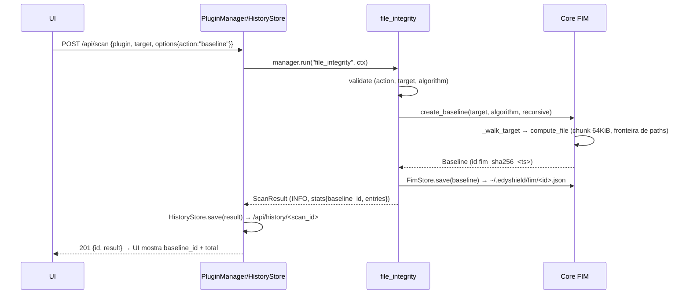
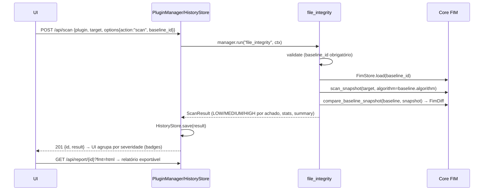

# 🛡️ EDY SHIELD — Arquitetura do File Integrity Monitor (FIM) — v2.0

> **Tech Lead:** jr (CyberShield AI) · **Arquiteto:** ATLAS
> **Versão:** 0.2.0 (proposta Sprint 5) · **Status:** PROPOSTA / ESPECIFICAÇÃO
> **Data:** 02/08/2026 · *Base: código real v1.1.0 (Sprint 3) — contracts.py, plugin_base.py, hash_checker.py, safe_path.py, history.py, report_engine.py, server.py*

---

## 1. Visão Geral

O **File Integrity Monitor (FIM)** é o principal diferencial técnico da v2.0: cria uma
**baseline** de integridade de um conjunto de arquivos (digest criptográfico + metadados) e
depois **detecta mudanças** — modificação, criação e remoção — em varreduras posteriores.

O FIM é um **plugin** (`file_integrity`) da plataforma EDY Shield: reutiliza o Core
(`compute_file`, `resolve_safe_path`, fronteira de paths), respeita as camadas unidirecionais
`ui → services → plugins → core` (ADR-002), integra-se ao `PluginManager`, `HistoryStore` e
Report Engine (JSON/TXT/HTML), e é consumido pela UI web dark via `/api/scan` — **sem novas
dependências runtime** (ADR-001).

| Princípio | Aplicação no FIM |
|---|---|
| Core 100% stdlib | Baseline em JSON, digest via `hashlib`, zero deps (ADR-001) |
| Camadas unidirecionais | `ui → services → plugins → core`; UI nunca chama o Core (ADR-002) |
| Tipagem forte | `dataclasses` frozen+slots, `typing`, mypy estrito |
| Segurança-first | Fronteira de paths reutilizada; baseline com round-trip validado |
| Sob demanda | Nada de watchdog/agendador — varredura quando a UI solicita |
| Testável | Módulos puros no core + plugin fino; cobertura ≥ 90% por módulo |

---

## 2. Requisitos

**Funcionais:**
- **RF-01 Baseline** — snapshot de integridade de um alvo (diretório ou arquivo): `path`
  relativo, `hexdigest`, `size_bytes`, `mtime_iso` por arquivo.
- **RF-02 Scan** — varrer o alvo novamente, comparar contra baseline salva e reportar
  **novos**, **modificados** e **removidos** (e **inalterados**).
- **RF-03 Compare** *(opcional v2.0)* — comparar duas baselines/snapshots entre si.
- **RF-04 Persistência** — baseline em `~/.edyshield/fim/<baseline_id>.json`, JSON apenas,
  validação na leitura (round-trip seguro; corrompido é rejeitado).
- **RF-05 Integração** — plugin via `PluginManager`; resultado em `ScanResult` com
  `findings` (severidade por tipo de mudança), `stats` e `summary`.
- **RF-06 Relatório** — exportação nos formatos existentes (`/api/report/{id}?fmt=...`)
  sem alteração no Report Engine.

**Não-funcionais / Arquiteturais:**
- **RN-01** Core 100% stdlib — sem `watchdog`, sem SQLite na v2.0 (SQLite é roadmap v2.1).
- **RN-02** Zero novas dependências runtime (ADR-001).
- **RN-03** Reutilizar `compute_file` + `resolve_safe_path` + contratos de plugin.
- **RN-04** Digest criptográfico é a **fonte de verdade**; `mtime`/`size` são triagem.
- **RN-05** Não seguir symlinks; registrar como ignorados.
- **RN-06** Varredura sob demanda; custo documentado (chunking 64 KiB).
- **RN-07** Mensagens de erro nunca expõem caminhos absolutos (padrão ARES-QA-005).

---

## 3. Arquitetura de Componentes

```text
┌──────────────────────────────────────────────────────────────────────────────┐
│ UI (app/ui) static: index.html / app.js / style.css (dark; nunca toca FS)   │
│   │ fetch POST /api/scan                                                    │
└───│──────────────────────────────────────────────────────────────────────────┘
    ▼
┌──────────────────────────────────────────────────────────────────────────────┐
│ SERVICES (app/services)                                                     │
│   PluginManager.run("file_integrity", ctx) → ScanResult                     │
│   HistoryStore(save/list/get/clear)        → ~/.edyshield/history/          │
│   ReportEngine.render(result, fmt)         → json | txt | html              │
└───│──────────────────────────────────────────────────────────────────────────┘
    ▼
┌──────────────────────────────────────────────────────────────────────────────┐
│ PLUGIN (app/plugins/builtin/file_integrity_plugin.py)                       │
│   validate → execute → health_check                                         │
│   baseline: create_baseline + FimStore.save                                 │
│   scan:     FimStore.load + scan_snapshot + compare_baseline_snapshot       │
│   mapeia mudanças → Evidence(severity/message/metadata)                     │
└───│──────────────────────────────────────────────────────────────────────────┘
    ▼
┌──────────────────────────────────────────────────────────────────────────────┐
│ CORE FIM (app/core/fim)  ← NOVO MÓDULO (100% stdlib, padrão ADR-006)       │
│   models.py     Baseline | BaselineEntry | Snapshot | FimDiff | ChangeType  │
│   baseline.py   create_baseline | load_baseline (round-trip validado)       │
│   scanner.py    scan_snapshot | compare_baseline_snapshot | _walk_target    │
│   store.py      FimStore (persistência ~/.edyshield/fim/ — padrão History)  │
└───│──────────────────────────────────────────────────────────────────────────┘
    ▼
┌──────────────────────────────────────────────────────────────────────────────┐
│ CORE EXISTENTE (reutilizado)                                                │
│   algorithms.hash_checker.compute_file(...)  · filesystem.safe_path.*       │
│   crypto.hashing.normalize_algorithm / HashAlgorithm (whitelist)            │
│   exceptions.domain.EDYShieldError (+ FimError — extensão)                  │
└──────────────────────────────────────────────────────────────────────────────┘
```

**Regras de camada:** (1) `app/core/fim` importa apenas o Core existente — nunca
`services`/`plugins`/`ui`; (2) o plugin `file_integrity` é o único que conhece a orquestração;
(3) a UI descobre o plugin via `GET /api/plugins` e envia JSON; (4) `FimStore` é adaptador de
persistência stdlib (JSON) no `core/fim`, seguindo a disciplina do `HistoryStore` — é o ponto
de troca para SQLite (v2.1) sem afetar contratos.

---

## 4. Contratos de API — `app/core/fim`

> Assinaturas completas com type hints. **Especificação para implementação** — VULCAN
> implementará na Fase 1 da Sprint 5.

### 4.1 `models.py` — tipos compartilhados

```python
from __future__ import annotations
from dataclasses import dataclass, field
from enum import Enum


class ChangeType(Enum):
    """Tipo de mudança detectado (ordem canônica)."""
    ADDED = "added"
    MODIFIED = "modified"
    REMOVED = "removed"
    UNCHANGED = "unchanged"


@dataclass(frozen=True, slots=True)
class BaselineEntry:
    """Entrada de integridade: path relativo (POSIX), hexdigest (fonte de
    verdade), size_bytes e mtime_iso (ISO 8601 UTC — triagem/diagnóstico)."""
    path: str
    hexdigest: str
    size_bytes: int
    mtime_iso: str


@dataclass(frozen=True, slots=True)
class Baseline:
    """Snapshot persistido com baseline_id (ex.: fim_sha256_20260802T120000Z),
    algorithm, version (1), created_at, root absoluto e entries ordenadas."""
    baseline_id: str
    algorithm: str
    version: int
    created_at: str
    root: str
    entries: tuple[BaselineEntry, ...] = field(default_factory=tuple)

    def to_dict(self) -> dict[str, object]: ...
    @classmethod
    def from_dict(cls, data: dict[str, object]) -> Baseline: ...


@dataclass(frozen=True, slots=True)
class Snapshot:
    """Varredura efêmera (memória): root, algorithm, created_at, entries."""
    root: str
    algorithm: str
    created_at: str
    entries: tuple[BaselineEntry, ...] = field(default_factory=tuple)

    @classmethod
    def from_baseline(cls, baseline: Baseline) -> Snapshot:
        """Converter Baseline persistida em Snapshot (para action=compare)."""


@dataclass(frozen=True, slots=True)
class FimDiff:
    """Diferença baseline × snapshot: added/modified/removed/unchanged/ignored
    (paths relativos) + baseline_id, algorithm, scanned_at."""
    baseline_id: str
    algorithm: str
    scanned_at: str
    added: tuple[str, ...] = field(default_factory=tuple)
    modified: tuple[str, ...] = field(default_factory=tuple)
    removed: tuple[str, ...] = field(default_factory=tuple)
    unchanged: tuple[str, ...] = field(default_factory=tuple)
    ignored: tuple[str, ...] = field(default_factory=tuple)

    @property
    def changed(self) -> int:
        """Total de mudanças (added + modified + removed)."""
```

### 4.2 `baseline.py` — criação e carga

```python
def create_baseline(target: Path, *, algorithm: HashAlgorithm | str = HashAlgorithm.SHA256,
                    recursive: bool = True, allowed_root: Path | None = None,
                    chunk_size: int = 65536, follow_symlinks: bool = False,
                    now: datetime | None = None) -> Baseline:
    """Compõe scan_snapshot + metadados (baseline_id, version, created_at).
    now injetável para testes; allowed_root=None deriva do alvo (ARES-QA-028)."""

def load_baseline(path: Path) -> Baseline:
    """Carregar/validar um arquivo JSON (regras seção 6.2).
    Raises: FileNotFoundError · BaselineCorruptionError."""
```

### 4.3 `scanner.py` — varredura e comparação

```python
def scan_snapshot(target: Path, *, algorithm: HashAlgorithm | str = HashAlgorithm.SHA256,
                  recursive: bool = True, allowed_root: Path | None = None,
                  chunk_size: int = 65536, follow_symlinks: bool = False,
                  now: datetime | None = None) -> Snapshot:
    """Varrer alvo e gerar Snapshot (os.scandir, fronteira de paths, compute_file
    com O_NOFOLLOW+fstat TOCTOU. Raises: HashError se path escapa da raiz)."""

def compare_baseline_snapshot(baseline: Baseline, snapshot: Snapshot) -> FimDiff:
    """Compara baseline vs snapshot. Fonte de verdade = digest (ADR-FIM-002):
    modified → mesmo path, hexdigest ≠; unchanged → mesmo digest;
    added → só na snapshot; removed → só na baseline.
    Raises: FimError se algorithm ou root divergem da baseline."""

def _walk_target(target: Path, *, recursive: bool, allowed_root: Path | None,
                 follow_symlinks: bool) -> Iterator[Path]:
    """Itera arquivos regulares em ordem determinística (os.scandir)."""
```

### 4.4 `store.py` — persistência (padrão HistoryStore)

```python
class FimStore:
    """Persiste baselines em <base_dir>/<baseline_id>.json.

    Segue o padrão de HistoryStore: criação automática do diretório, IDs com
    charset seguro (anti path traversal), JSON ensure_ascii=False, round-trip
    validado na leitura.

    Args:
        base_dir: Diretório de armazenamento (padrão: ~/.edyshield/fim).
    """

    def __init__(self, base_dir: Path) -> None: ...

    @staticmethod
    def build_id(algorithm: str, now: datetime | None = None) -> str:
        """Gerar fim_<algo>_<UTC %Y%m%dT%H%M%SZ> (ex.: fim_sha256_20260802T120000Z)."""

    def save(self, baseline: Baseline) -> str:
        """Persistir a baseline; retorna o baseline_id."""

    def load(self, baseline_id: str) -> Baseline:
        """Carregar/validar baseline pelo id.
        Raises: BaselineNotFoundError · BaselineCorruptionError."""

    def list(self) -> list[dict[str, object]]:
        """Metadados (id, algorithm, root, created_at, entry count), do mais
        recente ao mais antigo — usado pelo dropdown da UI."""

    def delete(self, baseline_id: str) -> bool:
        """Remover uma baseline; False se não existia."""
```

### 4.5 Extensão da hierarquia de erros (`app/core/exceptions/domain.py`)

```python
class FimError(EDYShieldError):
    """Raiz das falhas do domínio FIM (baseline/scanner/store)."""

class BaselineCorruptionError(FimError):
    """Baseline JSON inválida/corrompida — rejeitada no load (RF-04)."""

class BaselineNotFoundError(FimError):
    """Baseline inexistente no FimStore (baseline_id inválido)."""
```

---

## 5. Plugin `file_integrity`

```python
# app/plugins/builtin/file_integrity_plugin.py
class FileIntegrityPlugin(Plugin):
    name = "file_integrity"
    version = "0.1.0"
    description = (
        "Cria baseline de integridade (hashes + metadados) e detecta "
        "modificação, criação e remoção de arquivos em varreduras posteriores."
    )
    author = "EDY Shield Contributors"

    def __init__(self, store: FimStore | None = None) -> None: ...
```

| Campo `ScanContext` | Tipo | Descrição |
|---|---|---|
| `target` | `str \| Path` | Diretório ou arquivo alvo (obrigatório p/ `baseline` e `scan`). |
| `options["action"]` | `str` | `"baseline"` (padrão), `"scan"` ou `"compare"`. |
| `options["algorithm"]` | `str` | `"SHA256"` (padrão), `"SHA1"` ou `"MD5"` — whitelist do Core. |
| `options["recursive"]` | `bool` | Desce recursivamente em diretórios (padrão `True`). |
| `options["baseline_id"]` | `str` | Obrigatório em `scan`; referência em `compare`. |
| `options["compare_id"]` | `str` | Segunda baseline em `compare` (opcional v2.0). |
| `options["follow_symlinks"]` | `bool` | Sempre `False` por padrão (ADR-FIM-003). |
| `allowed_root` | `Path \| None` | Raiz permitida; `None` → raiz derivada do target (ARES-QA-028). |

**Mapeamento mudança → Evidência:**

| Mudança | Severity | `message` (PT-BR) | `metadata` |
|---|---|---|---|
| Novo arquivo | `LOW` | `arquivo novo: <path>` | `hexdigest`, `size_bytes` |
| Modificação | `MEDIUM` | `arquivo modificado: <path>` | `old_digest`, `new_digest`, `size_bytes` |
| Remoção | `HIGH` | `arquivo removido: <path>` | `old_digest`, `size_bytes` |
| Symlink ignorado | `INFO` | `symlink ignorado: <path>` | `target` (sem path absoluto) |

`stats` (em `scan`/`compare`): `scanned`, `added`, `modified`, `removed`, `unchanged`,
`ignored`. Em `baseline`: `baseline_id` e `entries` (total registrado).

**Orquestração (responsabilidade do plugin):**

```text
execute(context)
 ├─ action == "baseline"
 │    baseline = create_baseline(...)                  # usa scan_snapshot + metadados
 │    baseline_id = store.save(baseline)
 │    → ScanResult(INFO, stats {baseline_id, entries})
 ├─ action == "scan"
 │    baseline = store.load(baseline_id)               # algoritmo/root da baseline
 │    snapshot = scan_snapshot(target, algorithm=baseline.algorithm, ...)
 │    diff = compare_baseline_snapshot(baseline, snapshot)
 │    → ScanResult(findings por diff, stats scanned/added/modified/removed/unchanged/ignored)
 └─ action == "compare"
      a = store.load(baseline_id); b = store.load(compare_id)
      diff = compare_baseline_snapshot(a, Snapshot.from_baseline(b))
      → ScanResult(idêntico ao scan; observations {a, b})
```

O plugin é a **única** camada que conhece `FimStore` + Core FIM; a UI e o server apenas
passam JSON. Erros de domínio são traduzidos em `PluginExecutionError` pelo `PluginManager`.

---

## 6. Modelo de Dados

### 6.1 Baseline persistida (`~/.edyshield/fim/fim_sha256_20260802T120000Z.json`)

```json
{
  "version": 1,
  "baseline_id": "fim_sha256_20260802T120000Z",
  "algorithm": "SHA256",
  "created_at": "2026-08-02T12:00:00Z",
  "root": "C:/Users/edmil/app/conf",
  "entries": [
    {
      "path": "config.ini",
      "hexdigest": "e3b0c44298fc1c149afbf4c8996fb92427ae41e4649b934ca495991b7852b855",
      "size_bytes": 2048,
      "mtime_iso": "2026-08-01T09:30:00Z"
    },
    {
      "path": "certs/server.crt",
      "hexdigest": "4f53cda18c2baa0c0354bb5f9a3ecbe5ed12ab4d8e11ba873c2f11161202b945",
      "size_bytes": 1567,
      "mtime_iso": "2026-08-01T09:30:00Z"
    }
  ]
}
```

### 6.2 Regras de round-trip (validação na leitura — RF-04)

1. `version == 1` (senão → `BaselineCorruptionError`).
2. `baseline_id` casa com `^fim_[a-z0-9]+_\d{8}T\d{6}Z$` e charset seguro
   (`[A-Za-z0-9_.-]`, padrão `HistoryStore._SAFE_ID_RE`).
3. `algorithm` pertence à whitelist do Core (`HashAlgorithm`).
4. `entries` é lista; cada `path` é **relativo** (sem separador absoluto, sem `..`),
   com separadores POSIX (`/`), e único (sem duplicatas).
5. `hexdigest` tem o tamanho esperado do algoritmo (ex.: 64 hex p/ SHA256), lowercase.
6. `size_bytes >= 0`; `mtime_iso` é ISO 8601 parseável (UTC).
7. JSON malformado, campos ausentes ou tipos errados → `BaselineCorruptionError`
   (nunca retorna baseline parcial).

---

## 7. Fluxos

### 7.1 Fluxo `baseline`



### 7.2 Fluxo `scan`



### 7.3 Fluxo `compare` (opcional)

Idêntico ao `scan`, mas carrega **duas** baselines (`baseline_id` + `compare_id`) e compara
`Snapshot.from_baseline(b)` contra `baseline`. Útil para auditar "antes/depois" de uma
alteração controlada sem re-varrer o disco.

---

## 8. Integração com UI e Serviços

### 8.1 Via `/api/scan` (sem endpoint novo — núcleo v2.0)

O `POST /api/scan` existente já aceita `{"plugin", "target", "options"}` e constrói
`ScanContext(target, options)` — o plugin `file_integrity` encaixa **sem mudança de
contrato**. Fluxo:

1. `GET /api/plugins` → a UI **descobre** `file_integrity` automaticamente (lista dinâmica).
2. Formulário FIM na dashboard dark: `action` (select), `target` (input path), `recursive`
   (checkbox), `algorithm` (select), `baseline_id` (dropdown).
3. `POST /api/scan` → servidor executa via `PluginManager`, salva em `HistoryStore` e
   responde `201 {id, result}` — mesmo fluxo dos plugins atuais.
4. UI renderiza `findings` com badges de severidade (estilo do Report HTML) e `stats`.
5. Exportação: `GET /api/report/{id}?fmt=json|txt|html` — funciona **sem alteração** no
   Report Engine (o resultado é um `ScanResult` padrão).

### 8.2 Endpoint novo (leitura, recomendado para v2.0)

- `GET /api/fim/baselines` → lista metadados das baselines persistidas (`FimStore.list()`)
  para popular o dropdown `baseline_id`.
- `GET /api/fim/baselines/{baseline_id}` → visualizar baseline (opcional).

> **Regra:** o handler do server apenas chama `FimStore`; nenhuma lógica de negócio na UI.
> `allowed_root` permanece `None` no `ScanContext` → o plugin deriva a raiz do target
> (padrão ARES-QA-028, já usado por `hash_checker` e `log_analyzer`).

---

## 9. Limitações e Ameaças (revisão ARES)

| # | Ameaça / Limitação | Mitigação / Decisão |
|---|---|---|
| 1 | **mtime não prova integridade** — atacante pode `touch`/restaurar timestamps | Digest é a **fonte de verdade** (ADR-FIM-002); `mtime` é triagem/diagnóstico |
| 2 | **Custo de hashing em arquivos grandes** — CPU/IO O(tamanho) por varredura | Chunking 64 KiB (`compute_file`); varredura sob demanda; ~500 MB/s (SHA256 nativo); futuro: triagem `size+mtime` antes do hash |
| 3 | **TOCTOU na varredura** — arquivo muda entre `walk` e leitura | Reutilizar `compute_file` (`O_NOFOLLOW` + `fstat`, ARES-QA-008); residual documentado em `observations`; extrair `open_regular_file` público fica como refactor opcional |
| 4 | **Symlinks** — podem escapar da raiz ou apontar a alvos arbitrários | **Não seguir** (ADR-FIM-003); registrar como `ignored`/observação |
| 5 | **Baseline corrompida/temperada** — JSON adulterado | Round-trip validado (seção 6.2) → `BaselineCorruptionError`; baseline não assinada na v2.0 (anotado p/ hardening futuro) |
| 6 | **Raiz/alvo movido ou inacessível** | Comparação exige `root` e `algorithm` casando com a baseline (`FimError` claro); ilegíveis são observados, não abortam |
| 7 | **Path traversal no `baseline_id`** | IDs com charset seguro (`[A-Za-z0-9_.-]`, padrão `HistoryStore`) |
| 8 | **Varredura não incremental (v2.0)** | Sob demanda (ADR-FIM-004); incremental + SQLite ficam para v2.1 (roadmap existente) |
| 9 | **Custo financeiro** | Software local, stdlib: custo ~ zero (CPU/IO do host); sem cloud, sem deps novas |

---

## 10. Decisões de Arquitetura (ADR-FIM)

> ADRs propostos — materializados em `docs/adr/ADR-FIM-0xx.md` na Fase 1 da Sprint 5.

| ADR | Decisão | Motivo |
|---|---|---|
| ADR-FIM-001 | Baseline persistida como **JSON** em `~/.edyshield/fim/`, round-trip validado | Stdlib (ADR-001), inspecionável, rejeita corrompido; espelha `HistoryStore`; ponto de troca p/ SQLite (v2.1) |
| ADR-FIM-002 | **Digest criptográfico** é a fonte de verdade; `mtime`/`size` apenas triagem | mtime é forjável; SHA256 não tem colisão prática |
| ADR-FIM-003 | **Não seguir symlinks**; registrar como ignorados | Evita fuga da raiz e leitura de alvos arbitrários; comportamento determinístico |
| ADR-FIM-004 | **Varredura sob demanda** (sem watchdog/agendador) | UI já é sob demanda; zero deps; modo agente fica no roadmap v3.0 |
| ADR-FIM-005 | **Reutilizar a fronteira de paths** (`resolve_safe_path` + `compute_file` com `O_NOFOLLOW`/`fstat`) | Um único ponto de validação; TOCTOU mitigado no Core; plugin não lê filesystem por fora |
| ADR-FIM-006 | **Core FIM puro** (`app/core/fim`) + plugin fino que orquestra | Testabilidade (ADR-006); UI/serviços não conhecem detalhes de baseline/scan |

---

## 11. Roadmap de Implementação — Sprint 5

| Fase | Escopo | Arquivos (criar / modificar) | Critério de saída |
|---|---|---|---|
| **Fase 1** — Core FIM | `app/core/fim/` (models, baseline, scanner, store) + erros | **Criar:** `core/fim/{__init__,models,baseline,scanner,store}.py`, `tests/unit/test_fim_core.py` · **Modificar:** `core/exceptions/domain.py`, `core/__init__.py` (re-exports) | Unit ≥ 90%; round-trip validado (corrompido rejeitado); mypy strict 0; ruff limpo |
| **Fase 2** — Plugin | `file_integrity` orquestrando Core + FimStore | **Criar:** `plugins/builtin/file_integrity_plugin.py`, `tests/unit/test_fim_plugin.py` · **Modificar:** `plugins/builtin/__init__.py`, `ui/server.py` (`build_default_manager` registra; `FimStore` injetado) | `GET /api/plugins` lista o plugin; baseline+scan via manager; severidades corretas |
| **Fase 3** — Report/UI | Consumo pela UI dark + relatórios | **Modificar:** `ui/server.py` (`GET /api/fim/baselines`), `ui/static/app.js`, `ui/static/index.html`, `ui/static/css/style.css` · **Criar:** `tests/unit/test_fim_ui.py` | E2E: baseline → scan → relatório HTML/TXT/JSON; dropdown funcional |
| **Fase 4** — Hardening (ARES) | Revisão de segurança e conformidade | **Modificar:** `docs/THREAT_MODEL.md`, `docs/QA_REPORT.md`, `docs/ARCHITECTURE.md`, `CHANGELOG.md` · **Criar:** `docs/adr/ADR-FIM-001..006.md`, `tests/unit/test_fim_security.py` | Sem issues críticas/altas; testes negativos (corrompida, traversal no id, symlink escapando, mismatch root/algoritmo) |

**Estimativa de esforço:** ~10 arquivos criados e ~10 modificados. Sem novas dependências
runtime; sem mudança no contrato público de plugins (compatível com `API_STABILITY.md`).

---

## 12. QG-ATLAS — Checklist

- [x] Diagrama de componentes criado (seção 3)
- [x] Decisões documentadas em ADRs (seção 10 + ADR-FIM propostos)
- [x] Tecnologias escolhidas com justificativa (seção 2.2 — stdlib, whitelist, chunking)
- [x] Riscos identificados e mitigados (seção 9)
- [x] Custos estimados (seção 9, item 9 — custo local ~ zero; CPU/IO documentado)
- [x] Cross-check com ARES (seções 9 e 11 — Fase 4 hardening)

---

> **EDY Shield — Defenda. Verifique. Confie.**
> Documento gerado pelo TITAN AI SQUAD — jr (Tech Lead) + ATLAS (Arquiteto) · Especificação Sprint 5 — FIM v2.0
